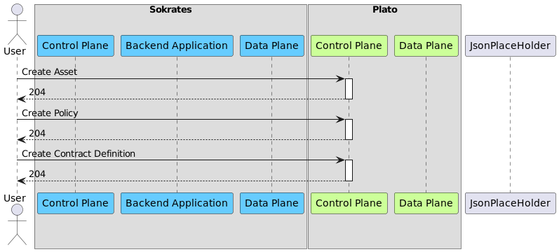
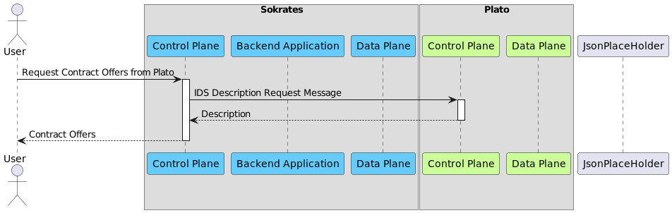
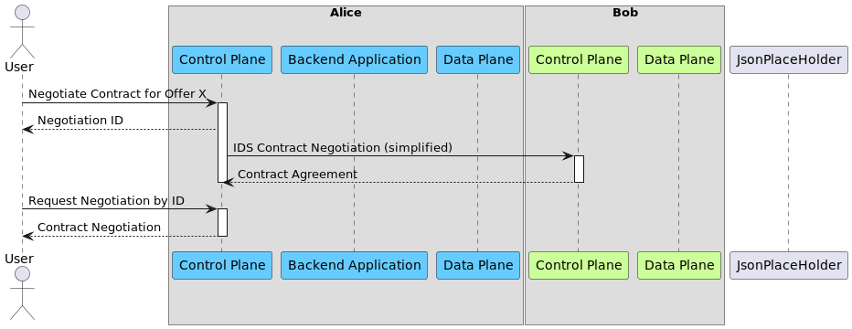
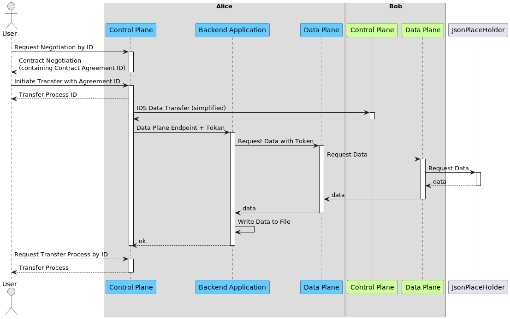
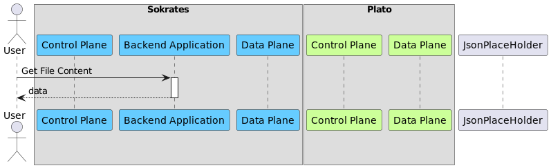

# Transfer Data

This document will showcase a data transfer between two connectors.

For this transfer connector **Bob** will act as data provider, and connector **Alice** will act as data
consumer. But the roles could be inverse as well. 

> Please note: Before running the examples the corresponding environment variables must be set.

**Contents**

1. Setup Data Offer
2. Request Contract Offers
3. Negotiate Contract
4. Transfer Data
5. Verify Data Transfer

## 1. Setup Data Offer

Set up a data offer in **Bob**, so that **Alice** has something to consume.

In case you are unfamiliar with the EDC terms `Asset`, `Policy` or `ContractDefinition` please have a look at the official open
source documentation ([link](https://github.com/eclipse-dataspaceconnector/DataSpaceConnector/blob/main/docs/developer/architecture/domain-model.md)).



**Run**


The following commands will create an Asset, a Policy and a Contract Definition.
For simplicity `https://jsonplaceholder.typicode.com/todos/1` is used as data source of the asset, but could be any
other API, that is reachable from the Provider Data Plane.

```bash
curl -X POST "$BOB_DATAMGMT_URL/data/assets" \
    --header 'X-Api-Key: password' \
    --header 'Content-Type: application/json' \
    --data '{
             "asset": {
                "properties": {
                        "asset:prop:id": "1",
                        "asset:prop:description": "Product EDC Demo Asset"
                    }
                },
                "dataAddress": {
                    "properties": {
                        "type": "HttpData",
                        "baseUrl": "https://jsonplaceholder.typicode.com/todos/1"
                    }
                }
            }' \
    -s -o /dev/null -w 'Response Code: %{http_code}\n'
```

```bash
curl -X POST "${BOB_DATAMGMT_URL}/data/policydefinitions" \
    --header 'X-Api-Key: password' \
    --header 'Content-Type: application/json' \
    --data '{
               "id": "1",
                "policy": {
                    "prohibitions": [],
                    "obligations": [],
                    "permissions": [
                        {
                            "edctype": "dataspaceconnector:permission",
                            "action": { "type": "USE" },
                            "constraints": []
                        }
                    ]
                }
            }' \
    -s -o /dev/null -w 'Response Code: %{http_code}\n'
```


```bash
curl -X POST "${BOB_DATAMGMT_URL}/data/contractdefinitions" \
    --header 'X-Api-Key: password' \
    --header 'Content-Type: application/json' \
    --data '{
                "id": "1",
                "criteria": [
                    {
                        "operandLeft": "asset:prop:id",
                        "operator": "=",
                        "operandRight": "1"
                    }
                ],
                "accessPolicyId": "1",
                "contractPolicyId": "1"
            }' \
    -s -o /dev/null -w 'Response Code: %{http_code}\n'
```

## 2. Request Contract Offer Catalog

In this step Alice gets told to request contract offers from another connector (in this case Bob). Alice will
then request the catalog over IDS messaging.

For IDS messaging connectors will identify each other using the configured IDS DAPS. Therefore, it is important that
connectors, that intent to send messages to each other, have the same DAPS instance configured.



**Run**

```bash
curl -G -X GET "${ALICE_DATAMGMT_URL}/data/catalog" \
    --data-urlencode "providerUrl=${BOB_IDS_URL}/api/v1/ids/data" \
    --header 'X-Api-Key: password' \
    --header 'Content-Type: application/json' \
    -s | jq
```

## 3. Negotiate Contract

Initiate a contract negotiation for the asset (from step 1). Part of the negotiation payload is the contract
offer (received in step 2).

In the diagram the IDS contract negotiation is marked as simplified, because the EDC is exchanging multiple messages
during contract negotiation. But the inter-controlplane communication is not in the scope of this document.

After the negotiation is initiated ensure that is has concluded. This is done by requesting the negotiation from the API
and checking whether the `contractAgreementId` is set. This might take a few seconds.



**Run**

```bash
export NEGOTIATION_ID=$( \
    curl -X POST "${ALICE_DATAMGMT_URL}/data/contractnegotiations" \
        --header "X-Api-Key: password" \
        --header "Content-Type: application/json" \
        --data "{
                    \"connectorId\": \"foo\",
                    \"connectorAddress\": \"${BOB_IDS_URL}/api/v1/ids/data\",
                    \"offer\": {
                        \"offerId\": \"1:foo\",
                        \"assetId\": \"1\",
                        \"policy\": {
                            \"uid\": \"1\",
                            \"prohibitions\": [],
                            \"obligations\": [],
                            \"permissions\": [
                                {
                                    \"edctype\": \"dataspaceconnector:permission\",
                                    \"action\": { \"type\": \"USE\" },
                                    \"target\": \"1\",
                                    \"constraints\": []
                                }
                            ]
                        }
                    }
                }" \
    -s | jq -r '.id')
```


```bash
curl -X GET "${ALICE_DATAMGMT_URL}/data/contractnegotiations/${NEGOTIATION_ID}" \
    --header 'X-Api-Key: password' \
    --header 'Content-Type: application/json' \
    -s | jq
```

## 4. Transfer Data

Initiate a data transfer using the contract agreement from the negotiation (from step 3). Then wait until the state of
the transfer process is `COMPLETED`.



**Run**

```bash
export CONTRACT_AGREEMENT_ID=$( \
    curl -X GET "$ALICE_DATAMGMT_URL/data/contractnegotiations/$NEGOTIATION_ID" \
    --header 'X-Api-Key: password' \
    --header 'Content-Type: application/json' \
    -s | jq -r '.contractAgreementId')
```

```bash
export TRANSFER_PROCESS_ID=$(tr -dc '[:alnum:]' < /dev/urandom | head -c20)
export TRANSFER_ID=$( \
    curl -X POST "${ALICE_DATAMGMT_URL}/data/transferprocess" \
    --header "X-Api-Key: password" \
    --header "Content-Type: application/json" \
    --data "{
                \"id\": \"${TRANSFER_PROCESS_ID}\", 
                \"connectorId\": \"foo\", 
                \"connectorAddress\": \"${BOB_IDS_URL}/api/v1/ids/data\", 
                \"contractId\": \"${CONTRACT_AGREEMENT_ID}\", 
                \"assetId\": \"1\", 
                \"managedResources\": \"false\", 
                \"dataDestination\": { \"type\": \"HttpProxy\" }
            }" \
     -s | jq -r '.id')
```

```bash
curl -X GET "$ALICE_DATAMGMT_URL/data/transferprocess/$TRANSFER_ID" \
    --header 'X-Api-Key: password' \
    --header 'Content-Type: application/json' \
    -s | jq
```

## 5. Verify Data Transfer

After the transfer is complete the Backend Application has downloaded the data. The Backend Application stores the data
locally. In this demo the transfer can be verified by executing a simple `cat` call in the Pod.



```bash
curl -X GET "${ALICE_BACKEND_URL}/${TRANSFER_PROCESS_ID}" \
    --header 'Accept: application/octet-stream' \
    -s | jq
```

# Delete All Data

```bash
minikube kubectl -- delete pvc -n edc-all-in-one --all
```

```bash
minikube kubectl -- delete pv -n edc-all-in-one --all
```
