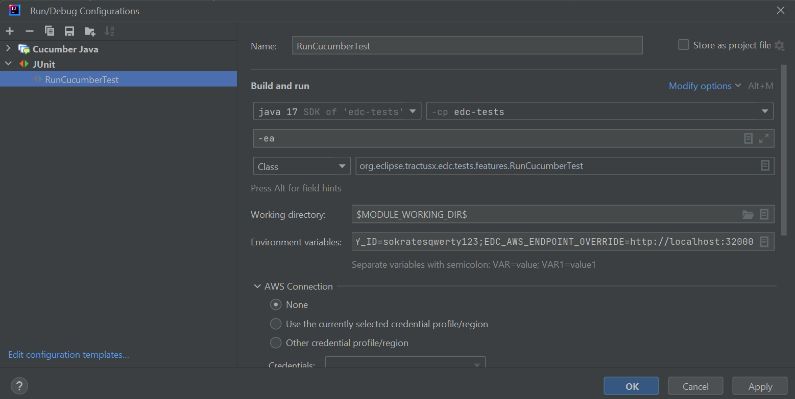

# Run and debug Business-Tests local within IDE
**Prerequisites:**
- You need a local kubernetes cluster to install the services (Docker Desktop is recommended).
- You need kubectl and helm command line tools installed.

### 1. Build all modules with maven and produce docker images

```shell
./gradlew dockerize
```

### 2. Install the all-in-one supporting infrastructure environment (Daps, Vault, PostgreSql, Minio, Backend-Service)
```shel
helm install infrastructure edc-tests/src/main/resources/deployment/helm/supporting-infrastructure -n business-tests --create-namespace
```

To access the PostgreSql databases you could use following kubectl port forwardings:
```shell
kubectl port-forward plato-postgresql-0 -n business-tests 5555:5432
kubectl port-forward sokrates-postgresql-0 -n business-tests 6666:5432
```
Please use the same ports later for your environment variables.

### 3. Install Plato as provider EDC
```shell
helm install plato charts/tractusx-connector -n business-tests --create-namespace \
  --set fullnameOverride=plato \
  --set controlplane.service.type=NodePort \
  --set controlplane.endpoints.data.authKey=password \
  --set controlplane.image.pullPolicy=Never \
  --set controlplane.image.tag=latest \
  --set controlplane.image.repository=edc-controlplane-postgresql-hashicorp-vault \
  --set dataplane.image.tag=latest \
  --set dataplane.image.pullPolicy=Never \
  --set dataplane.image.repository=edc-dataplane-hashicorp-vault \
  --set controlplane.debug.enabled=true \
  --set controlplane.suspendOnStart=false \
  --set postgresql.enabled=true \
  --set postgresql.username=user \
  --set postgresql.password=password \
  --set postgresql.jdbcUrl=jdbc:postgresql://plato-postgresql:5432/edc \
  --set vault.hashicorp.enabled=true \
  --set vault.hashicorp.url=http://vault:8200 \
  --set vault.hashicorp.token=root \
  --set vault.secretNames.transferProxyTokenSignerPublicKey=plato/daps/my-plato-daps-crt \
  --set vault.secretNames.transferProxyTokenSignerPrivateKey=plato/daps/my-plato-daps-key \
  --set vault.secretNames.transferProxyTokenEncryptionAesKey=plato/data-encryption-aes-keys \
  --set vault.secretNames.dapsPrivateKey=plato/daps/my-plato-daps-key \
  --set vault.secretNames.dapsPublicKey=plato/daps/my-plato-daps-crt \
  --set daps.url=http://ids-daps:4567 \
  --set daps.clientId=99:83:A7:17:86:FF:98:93:CE:A0:DD:A1:F1:36:FA:F6:0F:75:0A:23:keyid:99:83:A7:17:86:FF:98:93:CE:A0:DD:A1:F1:36:FA:F6:0F:75:0A:23 \
  --set dataplane.aws.endpointOverride=http://minio:9000 \
  --set dataplane.aws.secretAccessKey=platoqwerty123 \
  --set dataplane.aws.accessKeyId=platoqwerty123 \
  --set backendService.httpProxyTokenReceiverUrl=http://backend:8080 \
  --wait-for-jobs --timeout=120s
```

###  4. Install Socrates as consumer EDC
```shell
helm install sokrates charts/tractusx-connector -n business-tests --create-namespace \
  --set fullnameOverride=sokrates \
  --set controlplane.service.type=NodePort \
  --set controlplane.endpoints.data.authKey=password \
  --set controlplane.image.pullPolicy=Never \
  --set controlplane.image.tag=latest \
  --set controlplane.image.repository=edc-controlplane-postgresql-hashicorp-vault \
  --set dataplane.image.tag=latest \
  --set dataplane.image.pullPolicy=Never \
  --set dataplane.image.repository=edc-dataplane-hashicorp-vault \
  --set controlplane.debug.enabled=true \
  --set controlplane.suspendOnStart=false \
  --set postgresql.enabled=true \
  --set postgresql.username=user \
  --set postgresql.password=password \
  --set postgresql.jdbcUrl=jdbc:postgresql://sokrates-postgresql:5432/edc \
  --set vault.hashicorp.enabled=true \
  --set vault.hashicorp.url=http://vault:8200 \
  --set vault.hashicorp.token=root \
  --set vault.secretNames.transferProxyTokenSignerPublicKey=sokrates/daps/my-sokrates-daps-crt \
  --set vault.secretNames.transferProxyTokenSignerPrivateKey=sokrates/daps/my-sokrates-daps-key \
  --set vault.secretNames.transferProxyTokenEncryptionAesKey=sokrates/data-encryption-aes-keys \
  --set vault.secretNames.dapsPrivateKey=sokrates/daps/my-sokrates-daps-key \
  --set vault.secretNames.dapsPublicKey=sokrates/daps/my-sokrates-daps-crt \
  --set daps.url=http://ids-daps:4567 \
  --set daps.clientId=E7:07:2D:74:56:66:31:F0:7B:10:EA:B6:03:06:4C:23:7F:ED:A6:65:keyid:E7:07:2D:74:56:66:31:F0:7B:10:EA:B6:03:06:4C:23:7F:ED:A6:65 \
  --set dataplane.aws.endpointOverride=http://minio:9000 \
  --set dataplane.aws.secretAccessKey=sokratesqwerty123 \
  --set dataplane.aws.accessKeyId=sokratesqwerty123 \
  --set backendService.httpProxyTokenReceiverUrl=http://backend:8080 \
  --wait-for-jobs --timeout=120s
```

###  5. Set environment variables and run configuration in IDE
You can create a run configuration in IntelliJ like bellow screenshot and copy/paste the whole set of environments variables if you use ";" after each line.


```shell
PLATO_BACKEND_SERVICE_BACKEND_API_URL=http://localhost:<PORT>;
PLATO_DATA_MANAGEMENT_API_AUTH_KEY=password;
PLATO_DATA_MANAGEMENT_URL=http://localhost:<PORT>/data;
PLATO_DATA_PLANE_URL=foo;
PLATO_DATABASE_PASSWORD=password;
PLATO_DATABASE_URL=jdbc:postgresql://localhost:5555/edc;
PLATO_DATABASE_USER=user;
PLATO_IDS_URL=http://plato-controlplane:8084/api/v1/ids;
PLATO_AWS_SECRET_ACCESS_KEY=platoqwerty123;
PLATO_AWS_ACCESS_KEY_ID=platoqwerty123;
SOKRATES_BACKEND_SERVICE_BACKEND_API_URL=http://localhost:<PORT>;
SOKRATES_BACKEND_URL=http://localhost:<PORT>;
SOKRATES_DATA_MANAGEMENT_API_AUTH_KEY=password;
SOKRATES_DATA_MANAGEMENT_URL=http://localhost:<PORT>/data;
SOKRATES_DATA_PLANE_URL=foo;
SOKRATES_DATABASE_PASSWORD=password;
SOKRATES_DATABASE_URL=jdbc:postgresql://localhost:6666/edc;
SOKRATES_DATABASE_USER=user;
SOKRATES_IDS_URL=http://sokrates-controlplane:8084/api/v1/ids;
SOKRATES_AWS_SECRET_ACCESS_KEY=sokratesqwerty123;
SOKRATES_AWS_ACCESS_KEY_ID=sokratesqwerty123;
EDC_AWS_ENDPOINT_OVERRIDE=http://localhost:32000
```

The services are using NodePort to expose the endpoints therefore the ports are not fix and needs to be determined after each deployment.
To determine the current ports you can use the following kubectl command:
```shell
kubectl get svc -n business-tests -o go-template='{{range .items}}{{ $save := . }}{{range.spec.ports}}{{if .nodePort}}{{$save.metadata.namespace}}{{"/"}}{{$save.metadata.name}}{{" - "}}{{.name}}{{": "}}{{.nodePort}}{{"("}}{{.port}}{{")"}}{{"\n"}}{{end}}{{end}}{{end}}'
```
This will return all NodePorts which are available in business-tests namespace where you can pick the ports to use in your environment variables.
Now you are able to run it in IDE either as normal "Run" mode or in "Debug" mode where you can debug the business-tests by setting debugging points.

### 6. Update your components
Once everything is installed you just need to update your services when you have a new image.
```shell
helm upgrade plato charts/tractusx-connector --recreate-pods
helm upgrade sokrates charts/tractusx-connector --recreate-pods
```

### 7. Tips
If you use the kubernetes within Docker Desktop you have direct access to the images which you have created with Docker Desktop they are using the same docker daemon. So you don't need to transfer it in your k8s cluster.
