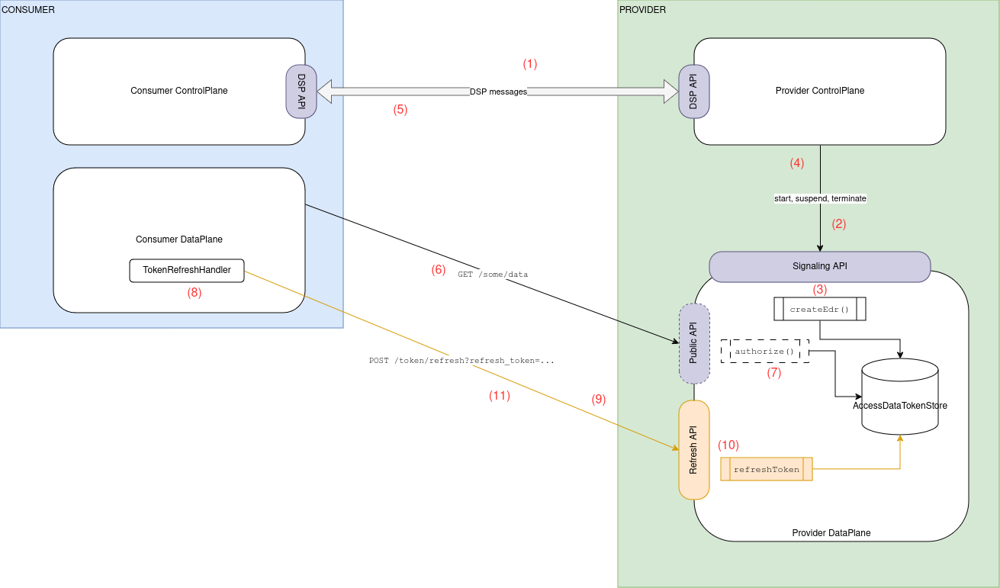
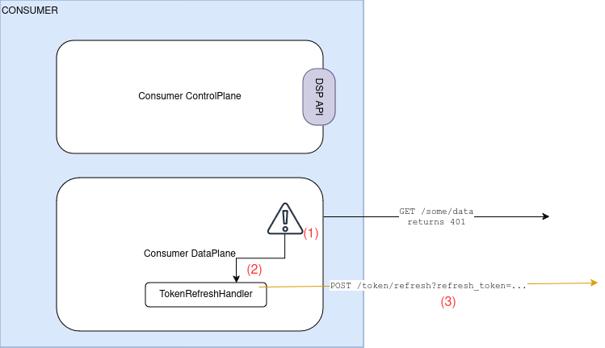
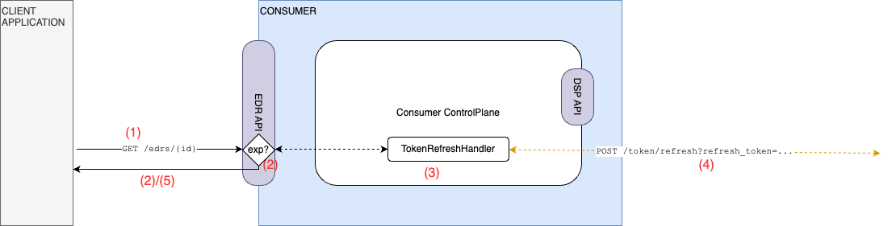
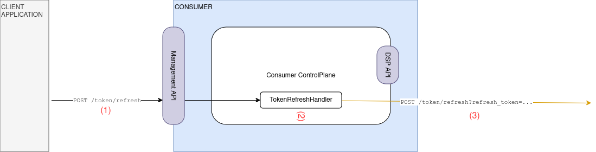

# Tractus-X EDC Extensions for DataPlane Signaling Token Refresh

This document details the architecture and implementation of the token refresh mechanism
that extends the DataPlane Signaling framework.

## Overview

The provider DataPlane exposes a new public facing API called the "Refresh API". Its purpose is to accept a refresh
token and an authentication token (see documentation [here](https://github.com/eclipse-tractusx/tractusx-profiles/blob/main/tx/refresh/refresh.token.grant.profile.md#3-the-refresh-request)), perform validity checks and then respond with a new
refresh token similar to this:

```json
{
  "access_token": "BWjcyMzY3ZDhiNmJkNTY...",
  "refresh_token": "Srq2NjM5NzA2OWJjuE7c...",
  "token_type": "Bearer",
  "expires": 3600
}
```

A complete sequence including `TransferRequestMessage` is shown here:

- `(1)`Consumer send `TransferRequestMessage`
- `(2)` Provider sends `DataFlowStartMessage` to its own DataPlane via the Signaling API
- `(3)` Provider's DataPlane creates an `EndPointDataReference` (
  see [here](https://eclipse-edc.github.io/documentation/for-contributors/data-plane/data-plane-signaling/#323-access-token-generation)
  for an example)
- `(4)` Provider's ControlPlane receives `EndpointDataReference` (= EDR)
- `(5)` Provider sends `TransferStartMessage` that contains the `EndpointDataReference` to the Consumer via DSP.
  Consumer stores EDR for subsequent use.
- `(6)` Consumer makes data requests against the Provider's public API (= data transfer). Those requests must carry the
  `token` from the EDR in the authorization header.
- `(7)` Provider authorizes the data request

_TOKEN EXPIRES_

- `(8)` The `TokenRefreshHandler` module creates the `authentication_token`
- `(9)` The `TokenRefreshHandler` module sends token refresh request to provider's public Refresh API
- `(10)` Provider performs authentication checks, creates a new `access_token` and a new `refresh_token`, updates
  internal records and sends the response back.



## Consumer: execute the token refresh

There are three possibilities for how the consumer performs the token refresh. Which one is suitable for a particular
customer will largely depend on the participant's deployment setup. These are not mutually excluding, they are merely
different approaches that are all supported by Tractus-X EDC.

### 1. Automatic refresh using the (consumer) DataPlane

This is suitable for deployments that elect to use a data plane on the consumer side, effectively acting as HTTP client.
Data requests are made by the consumer's data plane. Upon receiving an HTTP error code indicating an authentication
failure (HTTP 4xx), the consumer data plane refreshes the token using the `TokenRefreshHandler` and retries the request.
This is called "lazy refresh".



- `(1)`: Consumer data plane receives HTTP 401 indicating an auth failure
- `(2)`: The `TokenRefreshHandler` module creates the `authentication_token`
- `(3)`: The `TokenRefreshHandler` module sends token refresh request to provider's public Refresh API.

Note that if the token-refresh call also fails with an HTTP 4xx error code, the token must be regarded as invalid and
not authorized. An expired contract agreement or an unsatisfied policy could be reasons for that (
see [decision record](https://github.com/eclipse-edc/Connector/tree/main/docs/developer/decision-records/2023-09-07-policy-monitor)
and [documentation](https://eclipse-edc.github.io/documentation/for-contributors/control-plane/policy-monitor/)).

Alternatively, implementations of the `TokenRefreshHandler` could choose to proactively refresh the token if nearing
expiry instead of "letting it fail" first. _This is transparent to the client application._

### 2. Automatic refresh using the `/edrs` API

In this scenario it is the client application making the HTTP request against the provider's data plane. To do that, it
first has to use the `/edrs` API to obtain the access token. The `/edrs` API inspects the token and performs a refresh
if
required, then returns back a (possibly refreshed) access token to the client application:



- `(1)`: client application obtains token from EDR API
- `(2)`: EDR API (or a related component) checks if the token requires renewal
- `(3)`: EDR API triggers `TokenRefreshHandler` to make the refresh request
- `(4)`: `TokenRefreshHandler` calls refresh endpoint of provider data plane
- `(3)/(5)`: (refreshed) token is returned to client application

### 3. Manual refresh by the client application

Like in the previous section, this scenario outlines a deployment without a consumer data plane. The difference is, that
in this variant the access token is _not automatically renewed_ by the EDR API. This is suitable for client applications
that need to maintain control over the refresh process, e.g. due to some backoffice user permission system.
For those deployments Tractus-X EDC offers an endpoint in the management API `POST /v1/token/refresh` that client
applications can use to trigger the token renewal.



- `(1)`: the client application requests the access token using the EDR API
- `(2)`: the client application makes the data request against the provider's data plane
- `(3)`: that request is answered with a HTTP 4xx indicating an auth error
- `(4)`: client application triggers the token refresh via the control plane Management API
- `(5)` The `TokenRefreshHandler` module creates the `authentication_token` (
  see [documentation](https://github.com/eclipse-tractusx/tractusx-profiles/blob/main/tx/refresh/refresh.token.grant.profile.md#31-client-authentication))
- `(6)` The `TokenRefreshHandler` module sends token refresh request to provider's public Refresh API. Note that
  the `TokenRefreshHandler` module is the same as before, only that it is contained in the ControlPlane

### 4. Token refresh is handled completely out-of-band

Consumer's control plane and data plane are not involved. This is a very specific use case, and is only recommended if
neither of the other scenarios are viable. Note that Tractus-X EDC will provide no support for this scenario.
