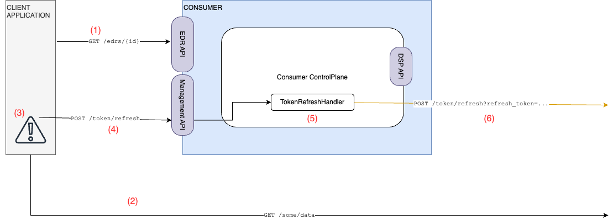

# Tractus-X EDC Extensions for DataPlane Signaling Token Refresh

This document details the architecture and implementation of the token refresh mechanism
that extends the DataPlane Signaling framework.

## Overview

The provider DataPlane exposes a new public facing API called the "Refresh API". Its purpose is to accept a refresh
token and an authentication token (see documentation [here]()), perform validity checks and then respond with a new
refresh token similar to this:

```json
{
  "access_token": "BWjcyMzY3ZDhiNmJkNTY...",
  "refresh_token": "Srq2NjM5NzA2OWJjuE7c...",
  "token_type": "Bearer",
  "expires": 3600
}
```

A complete sequence including `TransferRequestMessage` is shown here:

- `(1)`Consumer send `TransferRequestMessage`
- `(2)` Provider sends `DataFlowStartMessage` to its own DataPlane via the Signaling API
- `(3)` Provider's DataPlane creates an `EndPointDataReference` (
  see [here](https://github.com/eclipse-edc/Connector/blob/main/docs/developer/data-plane-signaling/data-plane-signaling-token-handling.md#2-updates-to-thedataaddress-format)
  for an example)
- `(4)` Provider's ControlPlane receives `EndpointDataReference` (= EDR)
- `(5)` Provider sends `TransferStartMessage` that contains the `EndpointDataReference` to the Consumer via DSP.
  Consumer stores EDR for subsequent use.
- `(6)` Consumer makes data requests against the Provider's public API (= data transfer). Those requests must carry the
  `token` from the EDR in the authorization header.
- `(7)` Provider authorizes the data request

_TOKEN EXPIRES_

- `(8)` The `TokenRefreshHandler` module creates the `authentication_token` (see [documentation]())
- `(9)` The `TokenRefreshHandler` module sends token refresh request to provider's public Refresh API
- `(10)` Provider performs authentication checks, creates a new `access_token` and a new `refresh_token`, updates
  internal records and sends the response back.


## Consumer: execute the token refresh

There are three possibilities for how the consumer performs the token refresh:

### Automatic refresh using the (consumer) DataPlane

Data requests are made by the consumer's data plane. Upon receiving
an HTTP error code indicating an authentication failure (HTTP 401), the consumer data plane refreshes the token using
the `TokenRefreshHandler` and retries the request. This is called "lazy refresh".


    - `(1)`: Consumer data plane receives HTTP 401 indicating an auth failure
    - `(2)` The `TokenRefreshHandler` module creates the `authentication_token` (see [documentation]())
    - `(3)` The `TokenRefreshHandler` module sends token refresh request to provider's public Refresh API.

### Trigger the refresh manually

When no consumer data plane exists, and HTTP data requests are made by some external
application, that external application needs to perform the token refresh. For that, Tractus-X EDC offers an endpoint
in the management API `POST /v1/token/refresh`.



    - `(1)`: external application detects an expired token and triggers the token refresh via the management API
    - `(2)` The `TokenRefreshHandler` module creates the `authentication_token` (see [documentation]())
    - `(3)` The `TokenRefreshHandler` module sends token refresh request to provider's public Refresh API. Note that
      the `TokenRefreshHandler` module is the same as before, only that it is contained in the ControlPlane

### Token refresh is handled completely out-of-band

Consumer's control plane and data plane are not involved. This is a 6very specific use case, and is only recommended if

1. and 2. are not suitable.
