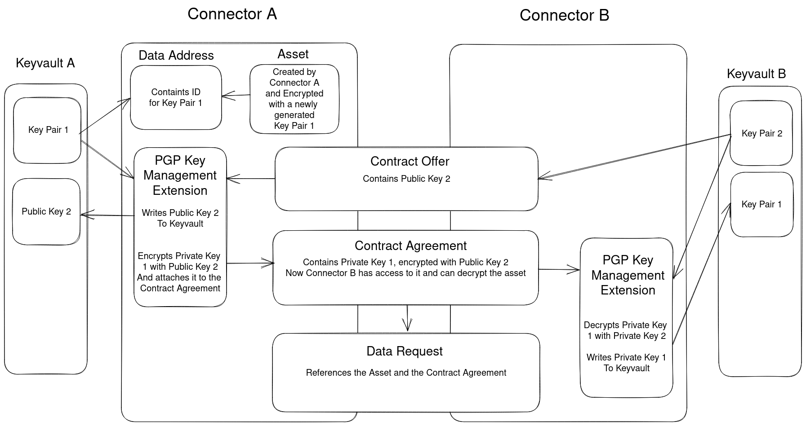

# Concept for Transfer of Encrypted Data via EDC

## Goal

We need to enable users to share encrypted data via the EDC while satisfying the following requirements:

- Private keys need to remain private.
- Only the recipient and optionally the sender are able to read the data.
- The same data can be shared with multiple recipients in a resource-conserving way.

## Proposal

We implement the usage of [PGP](https://en.wikipedia.org/wiki/Pretty_Good_Privacy) for encryption.
Since we already account for key storage, we just need to implement the creation and transfer of keys, as well as at-rest encryption.

## EDC Integration

The main challenge is how to handle the keys within the EDC framework.
Please find attached a graphic with details on a solution.
The gist of it is that an asset should be encrypted with a randomly generated key.
That key is saved into the keyvault by the creating connector.
A connector requesting a contract then attaches their personal public key to that contract offer.
The providing connector then encrypts the private key linked to the asset with this public key.
The encrypted private key is then attached to the contract agreement.
