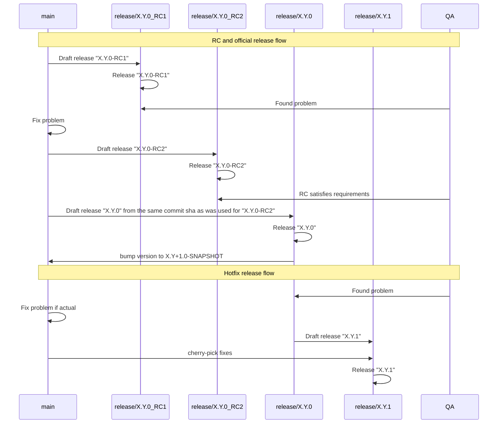

# Release Process Changes

## Decision

To streamline our release process, we will split it into two manually triggered workflows:

**Draft Release** - responsible for all release preparations and for creating the release branch.

**Release** - responsible for performing the actual release based on the release branch.

## Rationale

- **Flexibility:** We can now prepare a release branch from any commit SHA, not just `main`.
- **Clarity:** All tests and changes for a given release reside in its dedicated branch, making them easy to locate.
- **Simplicity:** Eliminates unnecessary pull requests against `main` and run tests prematurely during the GitHub Release.

## Approach 

Branch flows:

1. **`draft-release.yaml`**
- **Trigger:** Can be started from a specific commit SHA, the `HEAD` of `main`, the `HEAD` of any branch or tag.
- **Inputs:**
    1) commit SHA (if empty, will use `HEAD`)
    2) release version (required)
- **Actions:**
    1) Create a new `release/*` branch.
    2) Run `generate-and-check-dependencies` action in strict mode.
    3) Run automated tests.  
    4) On the release branch:
        - Bump the project version in `gradle.properties` and the Helm chart version based on the workflow’s input parameter.
    5) On the `main` branch:
        - For the official release, bump the project version in `gradle.properties` to the next `-SNAPSHOT`.
        - For release candidates (RC) or hotfixes, leave version in `gradle.properties` unchanged.
        - Update the Helm chart version according to the workflow’s input parameter.

2. **`release.yml`**
- **Trigger:** Can be started from the `HEAD` of a `release/*` branch.
- **Actions:**
    1) Publish artifacts (Maven, Docker, Helm).
    2) Create the Git tag for this release.
    3) Generate a GitHub Release entry.
    4) Publish the OpenAPI UI spec to GitHub Pages.
    5) Update release notes with a link to the Allure test-report.

3. **New Action:** `update-version-and-charts`
    - Automates version update in `gradle.properties` and `Chart.yaml`

4. **`verify.yaml`**
    - Extend to generate the Allure report for any `release/*` branch.
