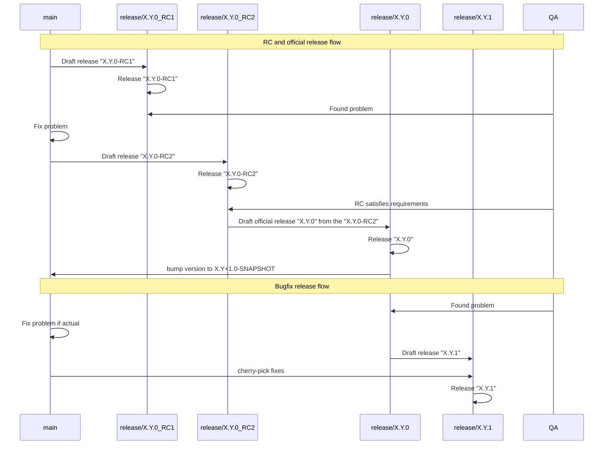

# Release Process Changes

## Decision

To harmonize the release process, all releases will be based solely on `release/*` branches. We will no longer create or 
use separate `bugfix/*` branches for release purposes, nor will we cut releases directly from `main`. In other words, 
there will be no distinction between bugfix and release branches — everything intended for a release must reside in a 
`release/*` branch. 

Additionally, draft releases workflow input version will be selected from predefined options (`RC` as the default, 
`bugfix`, or `official release`) instead of entering a free-text.

## Rationale

We want to follow the release process of providing release candidates (RC) for testing and then promoting the
successfully tested candidate to an official release. Simultaneously, we maintain a separate bugfix release process that
needs to be harmonized by providing some cohesion  — whether a bugfix, RC, or the official version, the release will
start from a `release/*` branch.

## Approach 

Branch flows:

1. **`draft-release.yaml`**
- **Trigger:** Should be started from the `HEAD` of `main` for an RC and the `HEAD` of a `release/*` 
   branch to promote an RC to an official version or to create a bugfix
- **Inputs:**
    1) Choice that will include `RC` (default), `bugfix`, `official release`.
- **Actions:**
    1) Identify branch name basing on the input.
    2) Create a new `release/*` branch.
    3) Run `generate-and-check-dependencies` action in strict mode.
    4) Run automated tests.  
    5) Bump the project version in `gradle.properties` and the Helm chart version based on the workflow’s input parameter.

2. **`release.yml`**
- **Trigger:** Should be started from the `HEAD` of a `release/*` branch.
- **Actions:**
    1) Publish artifacts (Maven, Docker, Helm).
    2) Create the Git tag for this release.
    3) Generate a GitHub Release entry.
    4) Publish the OpenAPI UI spec to GitHub Pages.
    5) Update release notes with a link to the Allure test-report.
    6) If the `official release`  released, make a changes on `main`:
       - Bump the project version in `gradle.properties` to the X.Y+1.0-SNAPSHOT.
       - Update the Helm chart version with the X.Y.0 version.

3. **New Action:** `update-version-and-charts`
    - Automates version update in `gradle.properties` and `Chart.yaml`

4. **`verify.yaml`**
    - Extend to generate the Allure report for any `release/*` branch.
