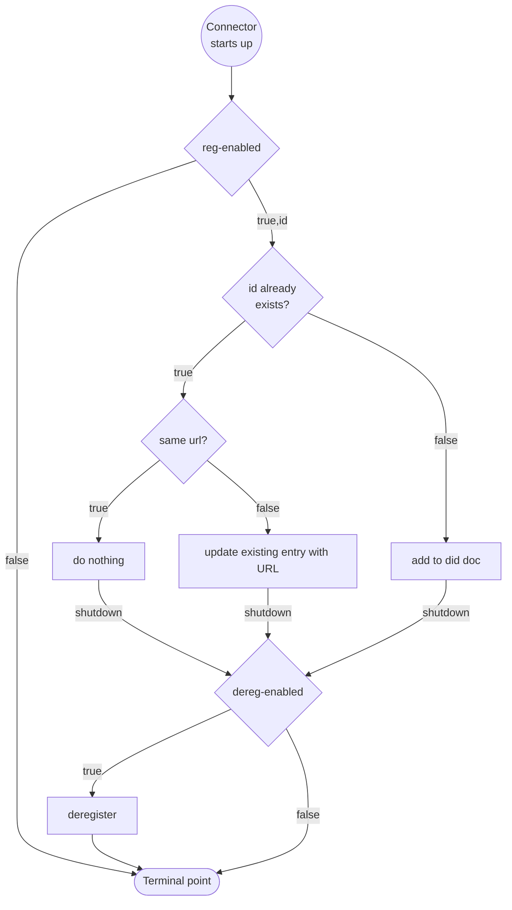

# DID Service Registration

## Decision

The controlplane will be enabled to register itself as `DataService` with the participant's did document. There will be
configuration variables to enable the feature, set an id for the DSP endpoint and point to the DID service's write-APIs.
There will not be an additional endpoint on the Management API - this logic is purely internal.

## Rationale

Standard CX-0001 describes the predominant method for discovering DSP endpoints as of CX release "Jupiter". It is a 
centralized service that is assumed to be a singleton.
Since the "Saturn" release, [CX-0018 section 2.6](https://catenax-ev.github.io/docs/next/standards/CX-0018-DataspaceConnectivity#26-participant-agent-management)
mandates that DID documents are used for discovery of DSP-endpoints based on DIDs. How that can be achieved is 
described in [DSP section 4](https://eclipse-dataspace-protocol-base.github.io/DataspaceProtocol/2025-1-err1/#discovery-of-service-endpoints)

Managing these `service` entries for DSP endpoints can become a chore: hosts may change, deployments may be 
deprovisioned. That's why there should be a solution that is extensible for each wallet implementation and smart enough 
to avoid creating duplicate `service` entries and manage itself.

## Approach

1. Introduce configuration options in application and helm chart.
2. Create a new SPI including an interface that represents the feature in an abstract manner.
3. An extension that implements the SPI's interface as client for [SAP DIV's write endpoint to the did document](https://api.sap.com/api/DIV/path/CompanyIdentityV2HttpController_updateCompanyIdentity_v2.0.0).
4. Another extension that will implement the lifecycle management logic.

The lifecycle management logic shall look like:



The SPI will look something like

```java

public interface DidServiceClient {

    void createService(String id, String urlOfWellKnown);
    
    void updateService(String id, String urlOfWellKnown);
    
    void deleteService(String id);
    
}

```

## Scaling considerations

As this extension triggers a side-effect on the DID Service, one must consider the case of horizontally scaled runtimes.
When scaling down, the shutdown sequence must not affect the did document service entry if another container is still
running. Containers aren't natively aware of each other and making them would be disproportionate effort. If
deregistration is enabled, this is a very realistic scenario.

The container image should receive two new environment variables:
- `TX_EDC_DID_SERVICE_SELF_REGISTRATION_ENABLED` (labeled *reg-enabled* in flowchart)
- `TX_EDC_DID_SERVICE_SELF_DEREGISTRATION_ENABLED` (labeled *dereg-enabled* in flowchart)

At the same time, requiring an admin to consider this when deploying the helm chart is unrealistic. That's why the
values yaml should look like:

```yaml
controlplane:
  didService:
    selfRegistration:
      # -- Whether Service Self Registration is enabled
      enabled: false
      # -- Unique id of connector to be used for register / unregister service inside did document (must be valid URI)
      id: "did:web:changeme"
```

The [deployment-controlplane.yaml](/charts/tractusx-connector/templates/deployment-controlplane.yaml) will infer `TX_EDC_DID_SERVICE_SELF_DEREGISTRATION_ENABLED`
by inspecting the scaling configuration like:

```yaml
- name: "TX_EDC_DID_SERVICE_SELF_DEREGISTRATION_ENABLED"
  value: {{ and (eq .Values.controlplane.replicacount 1) (not .Values.controlplane.autoscaling.enabled) }}
```

This approach may result in dangling references from the did document to dead endpoints. Cleanup of those lies outside
tractusx-edc responsibility and should be done on the DID service directly. This state is more desirable than having 
available but undiscoverable endpoints as consequence of deletion from every container that shuts down.
