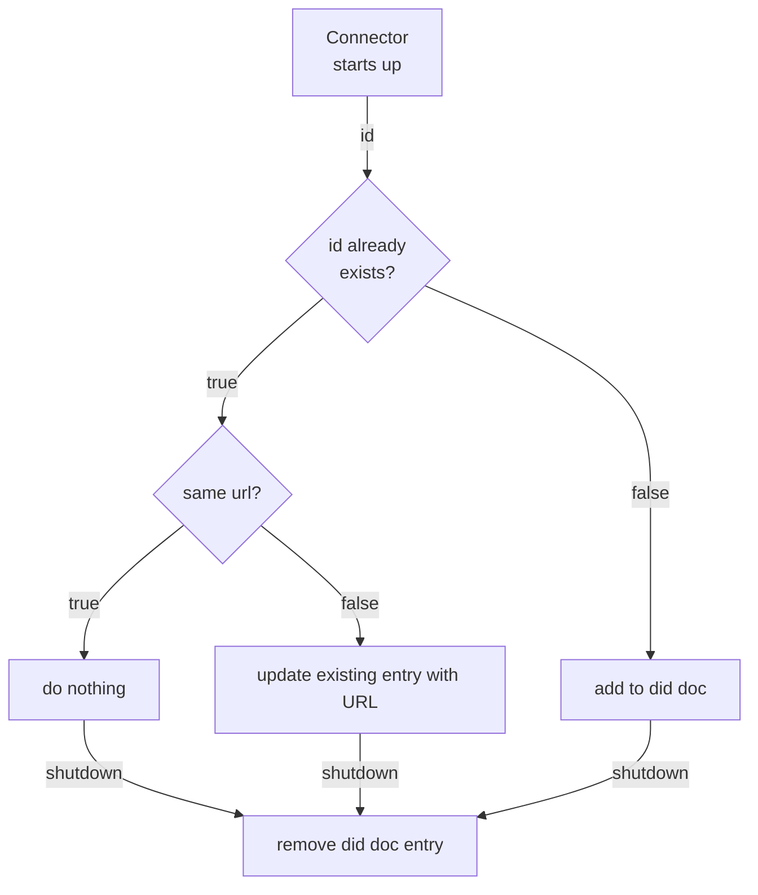

# DID Service Registration

## Decision

The controlplane will be enabled to register itself as `DataService` with the participant's did document. There will be
configuration variables to enable the feature, set an id for the DSP endpoint and point to the DID service's write-APIs.
There will not be an additional endpoint on the Management API - this logic is purely internal.

## Rationale

Standard CX-0001 describes the predominant method for discovering DSP endpoints as of CX release "Jupiter". It is a 
centralized service that is assumed to be a singleton.
Since the "Saturn" release, [CX-0018 section 2.6](https://catenax-ev.github.io/docs/next/standards/CX-0018-DataspaceConnectivity#26-participant-agent-management)
mandates that DID documents are used for discovery of DSP-endpoints based on DIDs. How that can be achieved is 
described in [DSP section 4](https://eclipse-dataspace-protocol-base.github.io/DataspaceProtocol/2025-1-err1/#discovery-of-service-endpoints)

Managing these `service` entries for DSP endpoints can become a chore: hosts may change, deployments may be 
deprovisioned. That's why there should be a solution that is extensible for each wallet implementation and smart enough 
to avoid creating duplicate `service` entries and manage itself.

## Approach

1. Introduce configuration options in application and helm chart.
2. Create a new SPI including an interface that represents the feature in an abstract manner.
3. Implement the interface as client for [SAP DIV's write endpoint to the did document](https://api.sap.com/api/DIV/path/CompanyIdentityV2HttpController_updateCompanyIdentity_v2.0.0).
4. The extension will perform self-cleanup in case the EDC is deprovisioned.

The resulting logic shall look like:



The SPI will look something like

```java

public interface DidServiceClient {

    void createService(String id, String urlOfWellKnown);
    
    void updateService(String id, String urlOfWellKnown);
    
    void deleteService(String id);
    
}

```