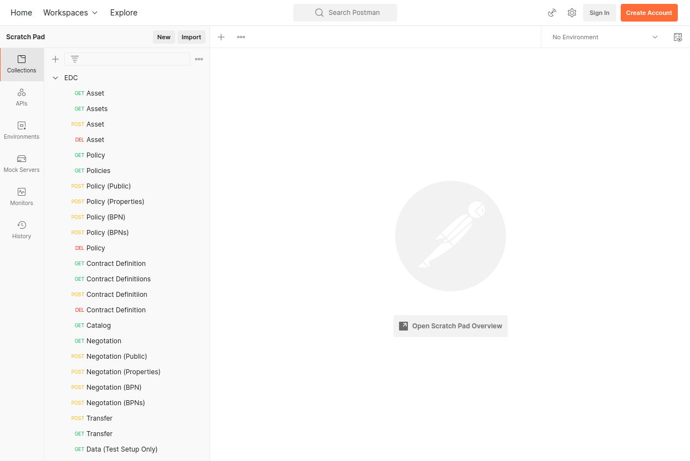

# Postman Collection

## Prerequisites

[![Postman][postman-shield]][postman-url]

## Postman

The Postman app can be used to send and receive EDC messages.

### Install/Download Postman 
please visit https://www.postman.com/downloads/

### Import Postman collection?
please visit https://learning.postman.com/docs/getting-started/importing-and-exporting-data/

## Collection

The postman collection contains the most common API calls. Please note hat the 

- Policy & Negotiation calls come in pairs for the different kinds of policies
- The 'Data' call only works when using the All-In-One Deployment of this repository

[postman-shield]: https://img.shields.io/badge/Postman-URL-orange
[postman-url]: https://www.postman.com