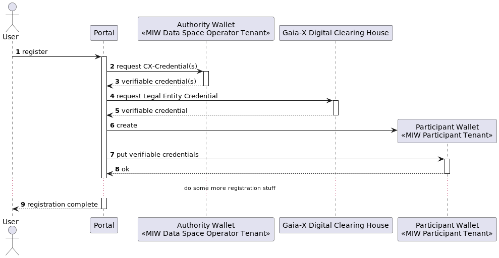

# Self-Sovereign Identity

> Draft

This document is intended to create a common understanding of SSI in Catena-X. The content described here can then be
used for documentation on the SSI topic.

## Table of Contents

1. Catena-X Onboarding
2. Connector Authentication

## 1. Catena-X Onboarding

The user registers at the portal. The portal then
- creates a new MIW tenant
- creates / requests some initial credentials for the tenant
- puts the verifiable credentials into the wallet of the tenant

## 2. Connector Authentication

If one connector sends out a catalog request to another connector
- it creates an IDS authentication token with a verifiable presentation
- it sends the IDS message with the token to the other connector

The receiving connector then
- checks the verifiable presentation for SSI compliance
- checks the verifiable presentation for authentication

