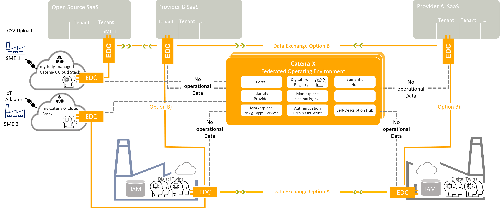

The ConnectorKit provides a connector framework, based on the [Eclipse Dataspace Connector][edc-url] for sovereign, cross-enterprise data exchange.

Trust, interoperability and data sovereignty, these are the objectives and values for secure and sustainable peer-to-peer data exchange between organizations and companies. The claim is data sovereignty: Whoever makes data available retains control and decides individually who is involved in the data exchange, how, when, where and under what conditions.

A corresponding concept was developed in the context of [Gaia-X][gaiax-url] and the [International Data Space Association][idsa-url]. The essential software component is the connector.

With the [EDC][edc-url], a new central communication component was created, which implements the following architectural principles:

- Simple, maintaining a small and efficient core with as few external dependencies as possible
- Interoperable, independent of platforms and ecosystems
- Decentralized, software components with the necessary capabilities for participating in a data room are located on the partners' side, data is only exchanged between the agreed points.
- Data protection is more important than data sharing, data to be transmitted are fundamentally linked to policies via contracts; a transfer without a contract is not possible.
- Separation of metadata and data enables high throughput rates for the actual data transfer.
- Consistent semantics for the data is the basis for the consistency of digital value creation.
- As far as possible, all processes, starting with determining the identity, through ensuring the contractually agreed regulations to data transmission, are automated.
- Existing standards and protocols ([GAIA-X][gaiax-url] and [IDSA][idsa-url]) are used as far as possible.

The [EDC][edc-url] as a connector implements a framework agreement for sovereign, cross-organizational data exchange. The International Data Spaces Standard (IDS) and relevant principles in connection with [GAIA-X][gaiax-url] were implemented. The connector is designed to be extensible to support alternative protocols and to be integrated into different ecosystems.

The objective is to set up a decentralized software component on the part of the respective partner, which bundles the skills required to participate in a data room and enables peer-to-peer connections between participants.
The focus here is particularly on the data sovereignty of the independent companies.
The functionality required for this is bundled in the open-source project "Eclipse Dataspace Connectors", to which the Catena-X partners contribute as part of the Eclipse Foundation.

The main difference between the EDC and the previous connectors of the [IDSA][idsa-url] is the separation of the communication into a channel for the metadata and one for the actual data exchange. The channel for the data supports various transmission protocols via so-called data plane extensions. The metadata is transmitted directly via the EDC interface, while the actual data exchange then takes place via the appropriate channel extension. In this way, a highly scalable data exchange is made possible.

The architecture of the EDC combines various services that are necessary for the above principles:

- An interface to the Identity Provider service, currently [IDSA][idsa-url]'s [Dynamic Attribute Provisioning System][daps-url]. This central service provides the identity and the corresponding authentication of the participants in the data exchange. (There is no authorization at this point). Decentralized solutions will also be supported in the future.
- The provision of possible offers (contract offering) which, on the one hand, stipulates the data offered and the associated terms of use (policies) in corresponding contracts.
- An interface for manual selection of data and associated contract offers.
- The actual data transfer via the data plane extension
- Interfaces for using other services such as a broker service or a registration service
- The connection of software systems on the customer and provider side

[edc-url]: https://github.com/eclipse-edc/Connector
[gaiax-url]: https://www.data-infrastructure.eu/GAIAX/Navigation/EN/Home/home.html
[idsa-url]: https://internationaldataspaces.org/
[daps-url]: https://www.dataspaces.fraunhofer.de/en/software/identity_provider.html