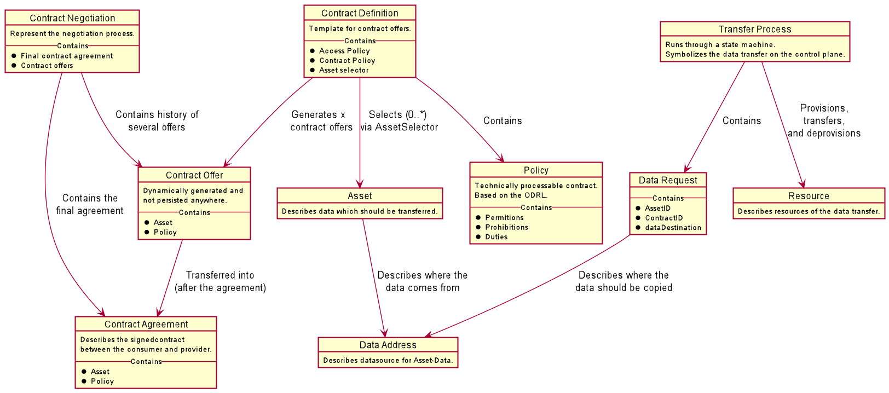

> The shown picture illustrates only a generic view of the Domain Model and is not intended to show all aspects of the project.

## Asset

An asset represents data (databases, files, cache information, etc.) which should be published and shared between
organizations. For each asset, a [`DataAddress`](#data-address) needs to be resolvable.

## Data address

A data address is a pointer into the physical storage location where an asset will be stored.

## Contract

A contract always contains one or more [`Assets`](#asset) and a single [`Policy`](#policy). The contract construct is
used to define the arrangement between two parties ("consumer" and "provider"). Regarding this arrangement, the contract
passes several stages which are explained below:

* ### Contract definition

  Contract definitions associate a policy with assets. A `ContractDefinition` object contains access policies, contract
  policies, and an asset selector which links the contract to one or more assets.

* ### Contract offer

  The contract offer is a dynamic representation of the [`ContractDefinition`](#contract-definition)
  for a specific consumer and serves as protocol's data transfer object (DTO) for a particular contract negotiation.
  Contract offers are not persisted and will be regenerated on every request. The connector acting as data provider will
  generate contract offers only for contract definitions dedicated to the organization or data space participant
  operating the requesting connector acting as data consumer. A contract offer is always related to a single asset of
  the `ContractDefinition` object (e.g. for a `ContractDefinition` containing three `Asset` objects, the connector will
  generate three `ContractOffer` objects).

* ### Contract negotiation

  A `ContractNegotiation` captures the current state of the negotiation of a contract (`ContractOffer` ->
  `ContractAgreement`) between two parties. This process is inherently asynchronous, so the `ContractNegotiation`
  objects are stored in a backing data store (`ContractNegotiationStore`).

* ### Contract agreement

  A contract agreement represents the agreed-upon terms of access and usage of an asset's data between two data space
  participants, including a start and an end date and further relevant information.

## Policy

Contract policies represent permitted and prohibited actions over a certain asset. These actions can be limited further
by constraints (temporal or spatial) and duties ("e.g. deletion of the data after 30 days").

## Data request

After a successful contract negotiation, a `DataRequest` is sent from a consumer connector to a provider connector to
initiate the data transfer. It references the requested [`Asset`](#asset) and [`ContractAgreement`](#contract-agreement)
as well as information about the [data destination](#data-address).

## Transfer process

Similar to the `ContractNegotiation`, this object captures the current state of a data transfer. This process is
inherently asynchronous, so the `TransferProcess` objects are stored in a backing data store (`TransferProcessStore`).
