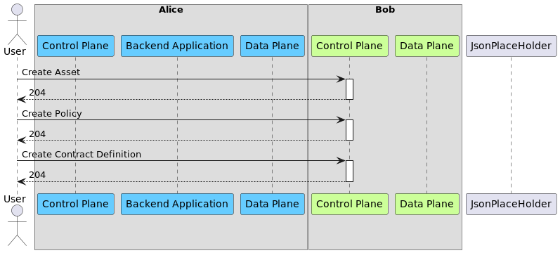
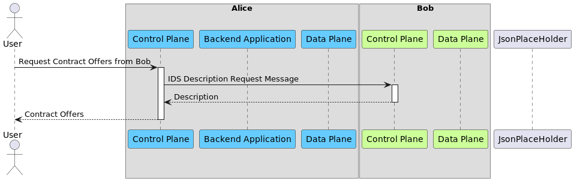
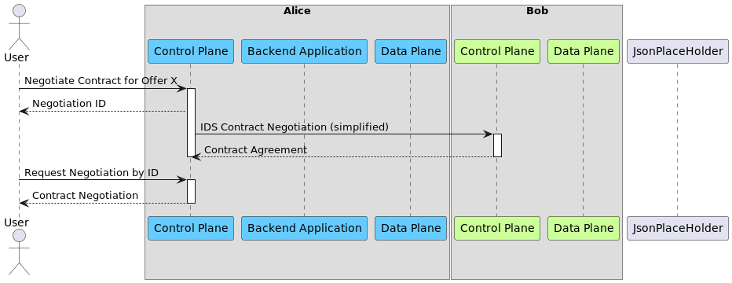
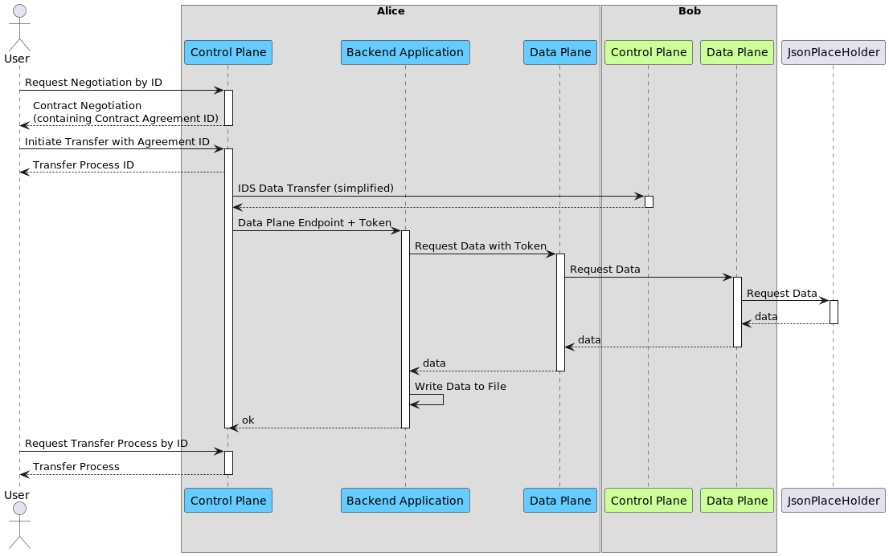
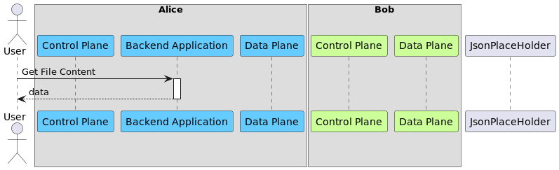

# Transfer Data

This document will showcase a data transfer between two connectors.

For this transfer connector **Bob** will act as data provider, and connector **Alice** will act as data
consumer. But the roles could be inverse as well.

> Please note: Before running the examples the corresponding environment variables must be set.
> How such an environment can be setup locally is documented in [chapter 0](#0--optional--local-setup).

**Contents**

0. [(optional) Local Setup](#0--optional--local-setup)
1. [Setup Data Offer](#1-setup-data-offer)
2. [Request Contract Offers](#2-request-contract-offer-catalog)
3. [Negotiate Contract](#3-negotiate-contract)
4. [Transfer Data](#4-transfer-data)
5. [Verify Data Transfer](#5-verify-data-transfer)

## 0. (optional) Local Setup

To create a local setup with two connectors have a look at
the [Local TXDC Setup Documentation](Local%20TXDC%20Setup.md).
It creates two connectors (Plato & Sokrates) with exposed Node Ports.

### See Node Ports using Minikube

Run the following command.

```shell
minkube service list
```

Minikube will then print out something like this:

```shell
|-------------|-----------------------|-----------------|---------------------------|
|  NAMESPACE  |         NAME          |   TARGET PORT   |            URL            |
|-------------|-----------------------|-----------------|---------------------------|
| cx          | backend               | frontend/8080   | http://192.168.49.2:31918 |
|             |                       | backend/8081    | http://192.168.49.2:30193 | < Transfer Backend API
| cx          | ids-daps              | No node port    |
| cx          | plato-controlplane    | default/8080    | http://192.168.49.2:31016 |
|             |                       | control/8083    | http://192.168.49.2:32510 |
|             |                       | data/8081       | http://192.168.49.2:30423 | < Plato Data Management API
|             |                       | validation/8082 | http://192.168.49.2:30997 |
|             |                       | ids/8084        | http://192.168.49.2:32709 | < Plato IDS API
|             |                       | metrics/8085    | http://192.168.49.2:31124 |
| cx          | plato-dataplane       | No node port    |
| cx          | sokrates-controlplane | default/8080    | http://192.168.49.2:32297 |
|             |                       | control/8083    | http://192.168.49.2:32671 |
|             |                       | data/8081       | http://192.168.49.2:31772 | < Sokrates Data Management API
|             |                       | validation/8082 | http://192.168.49.2:30540 |
|             |                       | ids/8084        | http://192.168.49.2:32543 | < Sokrates IDS API
|             |                       | metrics/8085    | http://192.168.49.2:30247 |
| cx          | sokrates-dataplane    | No node port    |
| cx          | vault                 | No node port    |
| cx          | vault-internal        | No node port    |
| cx          | vault-ui              | No node port    |
| default     | kubernetes            | No node port    |
| kube-system | kube-dns              | No node port    |
|-------------|-----------------------|-----------------|---------------------------|
```

The most important APIs, used by this example, are highlighted. How they are used is described in subchapter ['Set
Environment Variables](#set-environment-variables-used-by-this-example), used by this example below.

### See Node Ports using Kubernetes

Using Kubernetes only the Node Ports of each Service must be checked separately.

Run

```shell
kubectl describe service -n cx plato-controlplane 
```

or

```shell
kubectl describe service -n cx sokrates-controlplane 
```

Kubernetes will then print out something like this.

```shell
Name:                     plato-controlplane
Namespace:                cx
Labels:                   app.kubernetes.io/component=edc-controlplane
                          app.kubernetes.io/instance=plato-controlplane
                          app.kubernetes.io/managed-by=Helm
                          app.kubernetes.io/name=tractusx-connector-controlplane
                          app.kubernetes.io/part-of=edc
                          app.kubernetes.io/version=0.2.0
                          helm.sh/chart=tractusx-connector-0.2.0
Annotations:              meta.helm.sh/release-name: plato
                          meta.helm.sh/release-namespace: cx
Selector:                 app.kubernetes.io/instance=plato-controlplane,app.kubernetes.io/name=tractusx-connector-controlplane
Type:                     NodePort
IP Family Policy:         SingleStack
IP Families:              IPv4
IP:                       10.110.180.57
IPs:                      10.110.180.57
Port:                     default  8080/TCP
TargetPort:               default/TCP
NodePort:                 default  31016/TCP
Endpoints:                172.17.0.6:8080
Port:                     control  8083/TCP
TargetPort:               control/TCP
NodePort:                 control  32510/TCP
Endpoints:                172.17.0.6:8083
Port:                     data  8081/TCP
TargetPort:               data/TCP
NodePort:                 data  30423/TCP                      < Plato Data Manamgent API
Endpoints:                172.17.0.6:8081
Port:                     validation  8082/TCP
TargetPort:               validation/TCP
NodePort:                 validation  30997/TCP
Endpoints:                172.17.0.6:8082
Port:                     ids  8084/TCP
TargetPort:               ids/TCP
NodePort:                 ids  32709/TCP                        < Plato IDS API
Endpoints:                172.17.0.6:8084
Port:                     metrics  8085/TCP
TargetPort:               metrics/TCP
NodePort:                 metrics  31124/TCP
Endpoints:                172.17.0.6:8085
Session Affinity:         None
External Traffic Policy:  Cluster
Events:                   <none>
```

The most important APIs, used by this example, are highlighted. How they are used is described in subchapter ['Set
Environment Variables](#set-environment-variables-used-by-this-example), used by this example below.
In comparison to the Minikube example this call shows only the ports. To call the ports the Kubernetes Node IP / URL is
required. Where to get the IP may vary depending on how Kubernetes is deployed.

### Set Environment Variables, used by this example

Environment Variables, containing a URL, used by this example are
- BOB_DATAMGMT_URL
- ALICE_DATAMGMT_URL
- BOB_IDS_URL
- ALICE_BACKEND_URL

Let's assume we will use Sokrates as Bob, and Plato as Alice.

**BOB_DATAMGMT_URL** must be the Node URL. In this local setup it would be `http://192.168.49.2:31772`

**ALICE_DATAMGMT_URL** must be the Node URL. In this local setup it would be `http://192.168.49.2:30423`

**BOB_IDS_URL** must be internal Kubernetes URL. In this local setup `http://sokrates-controlplane:8084`

**ALICE_BACKEND_URL** must the Node URL. In this local setup it would be `http://192.168.49.2:30193`

## 1. Setup Data Offer

Set up a data offer in **Bob**, so that **Alice** has something to consume.

In case you are unfamiliar with the EDC terms `Asset`, `Policy` or `ContractDefinition` please have a look at the
official open source documentation ([link](https://github.com/eclipse-edc/Connector/blob/main/docs/developer/architecture/domain-model.md)).



**Run**

The following commands will create an Asset, a Policy and a Contract Definition.
For simplicity `https://jsonplaceholder.typicode.com/todos/1` is used as data source of the asset, but could be any
other API, that is reachable from the Provider Data Plane.

```bash
curl -X POST "${BOB_DATAMGMT_URL}/data/assets" \
    --header 'X-Api-Key: password' \
    --header 'Content-Type: application/json' \
    --data '{
             "asset": {
                "properties": {
                        "asset:prop:id": "1",
                        "asset:prop:description": "Product EDC Demo Asset"
                    }
                },
                "dataAddress": {
                    "properties": {
                        "type": "HttpData",
                        "baseUrl": "https://jsonplaceholder.typicode.com/todos/1"
                    }
                }
            }' \
    -s -o /dev/null -w 'Response Code: %{http_code}\n'
```

```bash
curl -X POST "${BOB_DATAMGMT_URL}/data/policydefinitions" \
    --header 'X-Api-Key: password' \
    --header 'Content-Type: application/json' \
    --data '{
               "id": "1",
                "policy": {
                    "prohibitions": [],
                    "obligations": [],
                    "permissions": [
                        {
                            "edctype": "dataspaceconnector:permission",
                            "action": { "type": "USE" },
                            "constraints": []
                        }
                    ]
                }
            }' \
    -s -o /dev/null -w 'Response Code: %{http_code}\n'
```

```bash
curl -X POST "${BOB_DATAMGMT_URL}/data/contractdefinitions" \
    --header 'X-Api-Key: password' \
    --header 'Content-Type: application/json' \
    --data '{
                "id": "1",
                "criteria": [
                    {
                        "operandLeft": "asset:prop:id",
                        "operator": "=",
                        "operandRight": "1"
                    }
                ],
                "accessPolicyId": "1",
                "contractPolicyId": "1"
            }' \
    -s -o /dev/null -w 'Response Code: %{http_code}\n'
```

## 2. Request Contract Offer Catalog

In this step Alice gets told to request contract offers from another connector (in this case Bob). Alice will
then request the catalog over IDS messaging.

For IDS messaging connectors will identify each other using the configured IDS DAPS. Therefore, it is important that
connectors, that intent to send messages to each other, have the same DAPS instance configured.



**Run**

```bash
curl -G -X GET "${ALICE_DATAMGMT_URL}/data/catalog" \
    --data-urlencode "providerUrl=${BOB_IDS_URL}/api/v1/ids/data" \
    --header 'X-Api-Key: password' \
    --header 'Content-Type: application/json' \
    -s | jq
```

## 3. Negotiate Contract

Initiate a contract negotiation for the asset (from step 1). Part of the negotiation payload is the contract
offer (received in step 2).

In the diagram the IDS contract negotiation is marked as simplified, because the EDC is exchanging multiple messages
during contract negotiation. But the inter-controlplane communication is not in the scope of this document.

After the negotiation is initiated ensure that is has concluded. This is done by requesting the negotiation from the API
and checking whether the `contractAgreementId` is set. This might take a few seconds.



**Run**

```bash
export NEGOTIATION_ID=$( \
    curl -X POST "${ALICE_DATAMGMT_URL}/data/contractnegotiations" \
        --header "X-Api-Key: password" \
        --header "Content-Type: application/json" \
        --data "{
                    \"connectorId\": \"foo\",
                    \"connectorAddress\": \"${BOB_IDS_URL}/api/v1/ids/data\",
                    \"offer\": {
                        \"offerId\": \"1:foo\",
                        \"assetId\": \"1\",
                        \"policy\": {
                            \"uid\": \"1\",
                            \"prohibitions\": [],
                            \"obligations\": [],
                            \"permissions\": [
                                {
                                    \"edctype\": \"dataspaceconnector:permission\",
                                    \"action\": { \"type\": \"USE\" },
                                    \"target\": \"1\",
                                    \"constraints\": []
                                }
                            ]
                        }
                    }
                }" \
    -s | jq -r '.id')
```

```bash
curl -X GET "${ALICE_DATAMGMT_URL}/data/contractnegotiations/${NEGOTIATION_ID}" \
    --header 'X-Api-Key: password' \
    --header 'Content-Type: application/json' \
    -s | jq
```

## 4. Transfer Data

Initiate a data transfer using the contract agreement from the negotiation (from step 3). Then wait until the state of
the transfer process is `COMPLETED`.



**Run**

```bash
export CONTRACT_AGREEMENT_ID=$( \
    curl -X GET "$ALICE_DATAMGMT_URL/data/contractnegotiations/$NEGOTIATION_ID" \
    --header 'X-Api-Key: password' \
    --header 'Content-Type: application/json' \
    -s | jq -r '.contractAgreementId')
```

```bash
export TRANSFER_PROCESS_ID=$(tr -dc '[:alnum:]' < /dev/urandom | head -c20)
export TRANSFER_ID=$( \
    curl -X POST "${ALICE_DATAMGMT_URL}/data/transferprocess" \
    --header "X-Api-Key: password" \
    --header "Content-Type: application/json" \
    --data "{
                \"id\": \"${TRANSFER_PROCESS_ID}\", 
                \"connectorId\": \"foo\", 
                \"connectorAddress\": \"${BOB_IDS_URL}/api/v1/ids/data\", 
                \"contractId\": \"${CONTRACT_AGREEMENT_ID}\", 
                \"assetId\": \"1\", 
                \"managedResources\": \"false\", 
                \"dataDestination\": { \"type\": \"HttpProxy\" }
            }" \
     -s | jq -r '.id')
```

```bash
curl -X GET "${ALICE_DATAMGMT_URL}/data/transferprocess/${TRANSFER_ID}" \
    --header 'X-Api-Key: password' \
    --header 'Content-Type: application/json' \
    -s | jq
```

## 5. Verify Data Transfer

After the transfer is complete the Backend Application has downloaded the data. The Backend Application stores the data
locally. In this demo the transfer can be verified by executing a simple `cat` call in the Pod.



```bash
curl -X GET "${ALICE_BACKEND_URL}/${TRANSFER_PROCESS_ID}" \
    --header 'Accept: application/octet-stream' \
    -s | jq
```

# Delete All Data

```bash
minikube kubectl -- delete pvc -n edc-all-in-one --all
```

```bash
minikube kubectl -- delete pv -n edc-all-in-one --all
```
