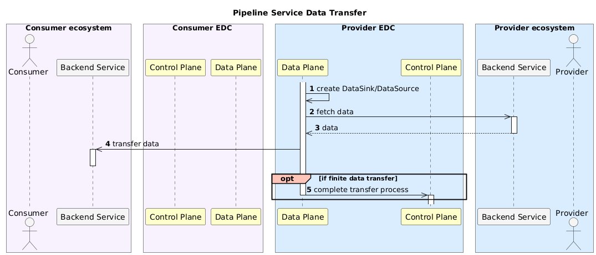
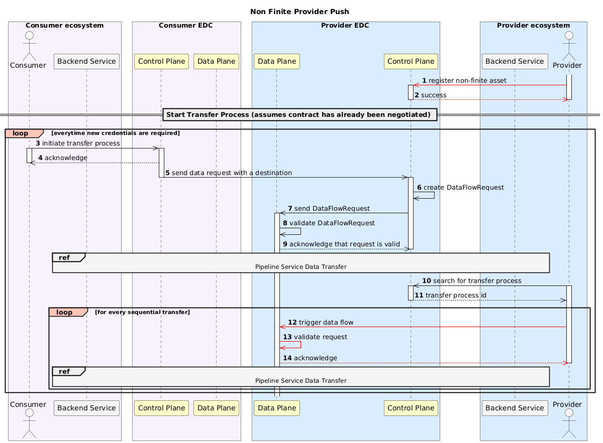

# Non-Finite Provider Push

Non-finite data is data that is defined by an infinite set or has no specified end. Data sources that produce non-finite 
data will continue producing new data chunks over their lifetime.

For PUSH transfers, non-finite data can be exchanged by repeatedly sending data chunks from the data source to the 
data destination whenever additional data becomes available.

The Non-Finite Provider Push feature integrates the Data Plane Framework, enabling Data Space participants to identify 
and transfer non-finite data with the PUSH flow type. The following diagrams describe this feature.





# Identifying Non Finite Data

Assets can identify data sources that produce non-finite data by setting the `isNonFinite` property. This is an optional 
data address property that represents the finiteness of the data address. Any value other than `true` will be ignored. 
As an example, the following request registers an `HttpData` Asset that represents an API that produces non-finite data:

```http request
POST /v3/assets HTTP/1.1
Host: https://consumer-control.plane/api/management
X-Api-Key: password
Content-Type: application/json
```

```json
{
	"@context": {},
	"@type": "Asset",
	"@id": "{{ASSET_ID}}",
	"dataAddress": {
		"@type": "DataAddress",
		"type": "HttpData",
		"isNonFinite": "true",
		"baseUrl": "{{BASE_URL}}"
	}
}
```

# Transferring Non-Finite Data

A Non-Finite Provider Push transfer is started by initiating a Transfer Process with PUSH flow type for an Asset that 
represents a non-finite data source. The Transfer Process must define a data destination where data will be sent to. Data 
destinations typically require access credentials, which should also be provided.

Once the Transfer Process starts, the data transfer is initiated and data from the data source will arrive at the data 
destination. After the transfer has succeeded, the Transfer Procesees states remain *STARTED*, indicating that the transfer 
is still ongoing.

The Data Provider can initiate additional transfers on demand by invoking the `DataFlow` API. This API is
available within the management API context and is exposed through the data plane. To trigger a new data transfer, execute 
the following request:

```http request
POST /v4alpha/dataflows/{{TRANSFER_PROCESS_ID}}/trigger HTTP/1.1
Host: https://provider-data.plane/api/management
X-Api-Key: password
Content-Type: application/json
```

The new contents of the data source will now be transferred again to the data destination. The Transfer Processes will 
remain in the *STARTED* state, allowing this trigger to be executed multiple times as new data becomes available.

The Connector does not calculate the difference between what has been sent and the new data to transfer. All data present 
on the data source at the time of the transfer will be pushed to the Consumer. This means that if only the delta is desired 
to be sent, the data source should be updated to reflect only the new information.

To close the communications channel, either the Consumer or the Provider must manually terminate the Transfer Process.

# Credential Rotation

The data destination credentials should be managed by an Identity Provider capable of granting and revoking acesses to the 
data destination.

For security, these credentials should be rotated periodically. The validity period depends on the specific use case and is 
determined by the Data Consumer. Ideally, it should be the shortest period that allows N data transfers.

When the validity period expires, the old credentials should be revoked and new ones generated in the Identity Provider. The 
Data Consumer must also terminate the existing Transfer Process and initiate a new one with the updated credentials.
