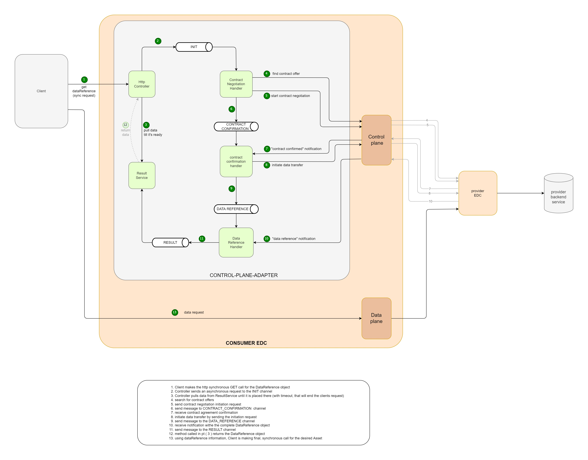

# Control Plane Adapter Extension

The goal of this extension is to simplify the process of retrieving data out of EDC. It returns "EndpointDataReference" object, hiding all the communication details for contract offers, contract negotiation process and retrieving DataReference from EDC control-plane.

Additional requirements, that affects the architecture of the extension:
- can return data both in SYNC and ASYNC mode (currently only SYNC endpoint available)
- can be persistent, so that process can be restored from the point where it was before application was stopped  
- scaling horizontally (when persistence is added to configuration)
- can retry failed part of the process (no need to start the process from the beginning)

## Configuration:

| Key                                              | Description                                                                                                                                                                                                                            | Mandatory | Default |
|:-------------------------------------------------|:---------------------------------------------------------------------------------------------------------------------------------------------------------------------------------------------------------------------------------------|------|---------|
| edc.cp.adapter.default.message.retry.number      | Number of retries of a message, in case of an error, within the internal process of retrieving DataReference                                                                                                                           | no   | 3       |
| edc.cp.adapter.default.sync.request.timeout      | Timeout for synchronous request (in seconds), after witch 'timeout' error will be returned to the requesting client                                                                                                                    | no   | 20      | 
| edc.cp.adapter.messagebus.inmemory.thread.number | Number of threads running within the in-memory implementation of MessageBus                                                                                          _ _                                                               | no   | 10      |
| edc.cp.adapter.reuse.contract.agreement          | Turn on/off reusing of existing contract agreements for the specific asset. Once the contract is agreed, the second request for the same asset will reuse the agreement (if exists) pulled from the EDC.  | no   | true    |
| edc.cp.adapter.cache.catalog.expire.after        | Number of seconds, after witch prevoiusly requested catalog will not be reused, and will be removed from catalog cache                                                                                                                 | no   | 300     |
| edc.cp.adapter.catalog.request.limit             | Maximum number of items taken from Catalog within single request. Requests are repeated until all offers of the query are retrieved                                                             | no   | 100     |

By default, the extension works in "IN MEMORY" mode. This setup has some limitations:
+ It can work only within single EDC instance. If CP-adapter requests are handled by more than one EDC, data flow may be broken.
+ If the EDC instance is restarted, all running processes are lost.

To run CP-Adapter in "PERSISTENT" mode, You need to create a proper tables with [this](docs/schema.sql) script, and add the following configuration values to Your control-plane EDC properties file:

| Key                               | Description |
|-----------------------------------|-------------|
| edc.datasource.cpadapter.name     | data source name |
| edc.datasource.cpadapter.url      | data source url |
| edc.datasource.cpadapter.user     | data source user |
| edc.datasource.cpadapter.password | data source password |


## How to use it:
1. Client sends a GET request with two parameters: assetId and the url of the provider control-plane:

   ```
   /adapter/asset/sync/{assetId}?providerUrl={providerUrl}
   ```

   The example ULR could be:

   ```
   http://localhost:9193/api/v1/data/adapter/asset/sync/123?providerUrl=http://localhost:8182/api/v1/ids/data
   ```
   
   Optional request parameters, that overwrite the settings for a single request:

   | Name | Description                                                                                                                                                                                                               |
   |---------------------------------------------------------------------------------------------------------------------------------------------------------------------------------------------------------------------------|--- |
   | contractAgreementId    | Defines the ID of existing contract agreement, that should be reused for retrieving the asset. If parameter is specified, but contract is not found, 404 error will be returned.                                          |
   | contractAgreementReuse | Similar to <i>edc.cp.adapter.reuse.contract.agreement</i> option allows to turn off reusing of existing contracts, but on a request level. Set the parameter value to 'false' and new contract agrement will be negotiated. |
   | timeout                | Similar to <i>edc.cp.adapter.default.sync.request.timeout</i>, defines the maximum time of the request. If data is not ready, time out error will be returned.                                                            |
   
   The controller is registered under the context alias of DataManagement API. The authentication depends on the DataManagement configuration.
   To find out more please visit:

   [api-configuration](../../edc/extensions/control-plane/api/data-management/api-configuration/README.md)

   [data-management](../../edc/extensions/control-plane/api/data-management/README.md)

                
2. EndpointDataReference object is returned. Example of the EndpointDataReference response:
    ```json
    {
      "id": "ee8b758a-4b02-4cca-bb37-d0256b4638e7",
      "endpoint": "http://consumer-dataplane:9192/publicsubmodel?provider-connector-url=...",
      "authKey": "Authorization",
      "authCode": "eyJhbGciOiJSUzI1NiJ9.eyJkYWQiOi...",
      "properties": {
        "cid": "1:b2367617-5f51-48c5-9f25-e30a7299235c"
      }
    }
    ```

3. Client, using the DataReference, retrieves the Asset through data-plane.
   
   Example of the data-plane GET request, to retrieve Asset, with DataReference information:
   
   ```
   url:          http://consumer-dataplane:9192/publicsubmodel?provider-connector-url=...                {endpoint}
   header:       Authorization:eyJhbGciOiJSUzI1NiJ9.eyJkYWQiOi...                                        {authKey:authCode}
   ```

### Internal design of the extension:




