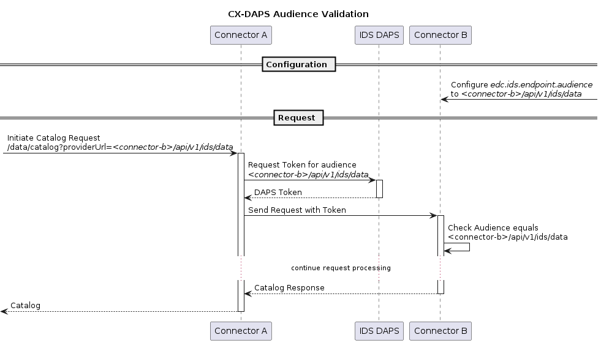

# Catena-X OAuth2 Extension

## Why Catena-X needs this extension

In IDS the DAPS token audience is always `idsc:IDS_CONNECTORS_ALL`. At first glance this makes it possible for other connectors to steal and reuse an received token. To mitigate this security risk IDS introduces something called `transportCertsSha256`, which couples the connector audience with its corresponding TLS/SSL certificate.

From [GitHub IDS-G](https://github.com/International-Data-Spaces-Association/IDS-G/tree/main/Components/IdentityProvider/DAPS)

> - **transportCertsSha256** Contains the public keys of the used transport certificates, hashed using SHA256. The identifying X509 certificate should not be used for the communication encryption. Therefore, the receiving party needs to connect the identity of a connector by relating its hostname (from the communication encryption layer) and the used private/public key pair, with its IDS identity claim of the DAT. The public transportation key must be one of the `transportCertsSha256` values. Otherwise, the receiving connector must expect that the requesting connector is using a false identity claim. In general, this claim holds an Array of Strings, but it may optionally hold a single String instead if the Array would have exactly one element.

The reason IDS did this is to prevent the IDS DAPS to know, which connectors talk to each other. But this solution introduces a new level of complexity for different deployment scenarios. The Catena-X OAuth2 Extension introduces the classic audience validation again, so that Catena-X does not have to deal with these things for now.

## Configuration

| Key | Description | Mandatory | Default |
|:----|:----|----|----|
| edc.oauth.token.url | Token URL of the DAPS | X | |
| edc.oauth.public.key.alias | Vault alias of the public key | X | |
| edc.oauth.client.id | DAPS client id of the connector | X | |
| edc.oauth.private.key.alias | Vault lias of the private key | X | |
| edc.oauth.token.expiration.seconds | | | 5 minutes |
| edc.oauth.validation.nbf.leeway | DAPS token request leeway | | 10 seconds |
| edc.oauth.provider.jwks.refresh | Time between refresh of the DAPS json web key set | | 5 minutes |
| edc.ids.endpoint.audience | The audience the connector requests from the DAPS. Should be the IDS URL of the connector, e.g. `http://plato-edc-controlplane:8282/api/v1/ids/data` | X | |
| edc.ids.validation.referringconnector | Adds checks to the DAPS token. Validation that the `referringConnector` equals the `issuerConnector` and the `securityProfile` of the token is equal to the profile of the IDS message | | false |

## Audience Validation

Instead of the `idsc:IDS_CONNECTORS_ALL` the connector requests a specific audience from the DAPS. This audience will be the IDS URL, the connector intends to call.

When a connector receives a message, it will checks the token audience is equal to the configured value in `edc.ids.endpoint.audience`.

