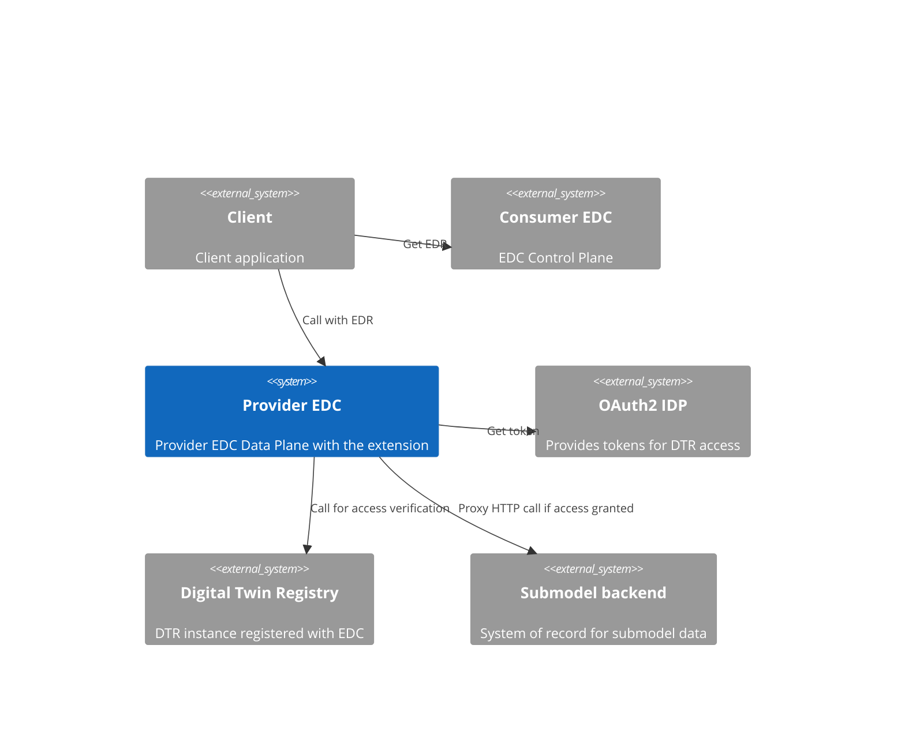
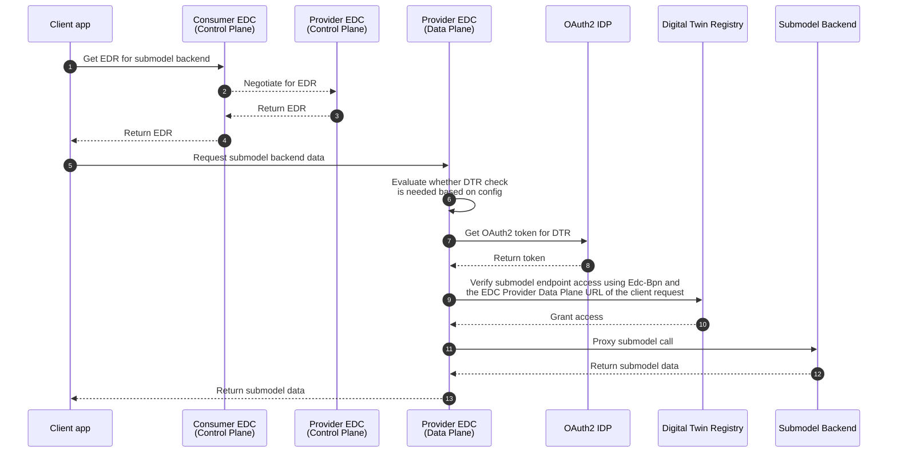
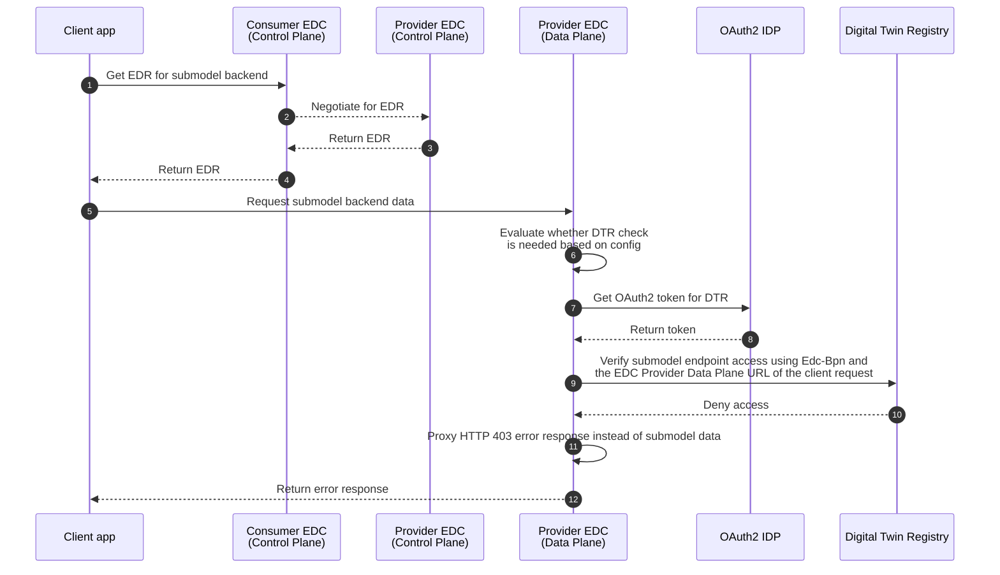
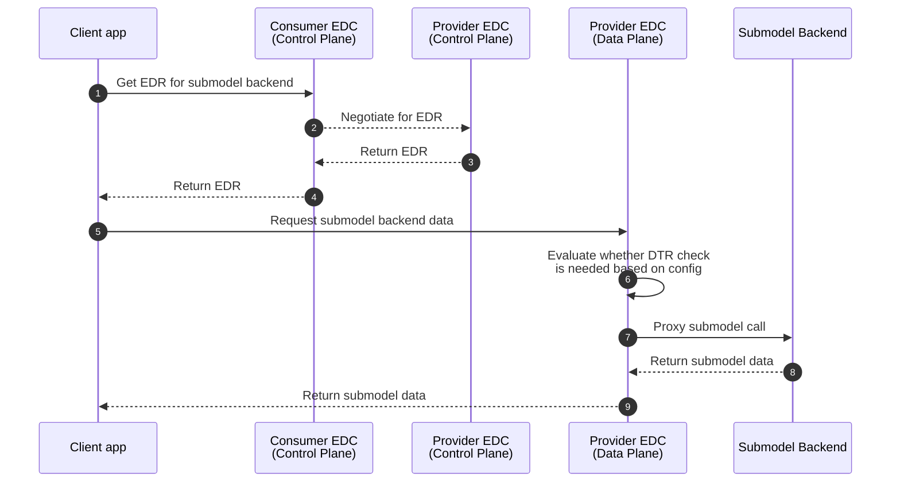

# Data Plane: Digital Twin Registry Http Access Control

The goal of this extension is to perform granular access control checks using the Digital Twin Registry (or 
Digital Twin Registries) configured.

When an HTTP request is targeting a configured Digital Twin Registry, the extension allows the request through.

Otherwise, the extension calls the configured access verification endpoints of the configured Digital Twin 
Registries and tries to verify that the client has access to the backend asset based on the registries' response.


## Configuration

```properties
# Configure the automatically added error endpoint that is used as an alternative target when the client 
# request cannot be allowed to reach the original backend target
edc.granular.access.verification.error.endpoint.port=9054

# Configure the URL which is used when the clients are reaching the EDC Data Plane's /public/ endpoint 
edc.granular.access.verification.edc.data.plane.baseUrl=http://edc-data-plane:9051/public/

# List the names of each DTR instance we intend to configure (comma separated list)
edc.granular.access.verification.dtr.names=default

# Configure each DTR instance using the following properties.
# "use the edc.granular.access.verification.dtr.config.<dtr_name>." prefix with each name listed above

# How long should we cache the response we have received from DTR?
edc.granular.access.verification.dtr.config.default.dtr.decision.cache.duration.minutes=1
# A RegExp pattern that can match the submodel endpoints in scope for DTR access control
edc.granular.access.verification.dtr.config.default.aspect.model.url.pattern=http:\/\/aspect-model:8080\/path\/.*
# The full URL of the access control verification endpoint of the DTR instance
edc.granular.access.verification.dtr.config.default.dtr.access.verification.endpoint.url=http://dtr:8080/aas-registry-api/v3.0/submodel-descriptor/authorized
# The OAuth2 configuration for accessing the DTR
# Token endpoint URL
edc.granular.access.verification.dtr.config.default.oauth2.token.endpoint.url=http://oauth2-iam:8080/iam/access-management/v1/tenants/00000000-0000-0000-0000-000000000000/openid-connect/token
# Scope (audience) of the token we want to obtain
edc.granular.access.verification.dtr.config.default.oauth2.token.scope=aud:dtr
# OAuth2 client Id
edc.granular.access.verification.dtr.config.default.oauth2.token.clientId=dtr_client
# The name (path) of the secret where the OAuth2 client secret is stored in the Vault
edc.granular.access.verification.dtr.config.default.oauth2.token.clientSecret.path=dtrsecret
```
> [!NOTE]
> If none of these properties are configured, the extension is turned off.

## Dependencies

The following header is used from the `HttpDataAddress` when the access control is evaluated before data transfer:

- `Edc-Bpn`: the BPN of the consumer

## How it works?

### System context (Logical view)



### Call sequences (Runtime view)

#### Prerequisites

In order to perform any of the following actions, we must assume that:

1. The Digital Twin Registry and the Submodel Backend are both registered in EDC as assets
2. The Submodel Backend asset configured to proxy the request path and query parameters
3. The client knows how to access the Digital Twin Registry through EDC
4. The client received the Submodel Backend endpoint address from the Digital Twin Registry containing:
   1. The full EDC Data Plane URL including the proxied path and query parameters (if any) in ```href```
   2. The Id of the EDC asset referencing the Submodel Backend
   3. The provider EDC control Plane's URL
5. The DTR HTTP Access Control extension is properly configured to call the Digital Twin Registry when the 
   ```HttpDataAddress``` URL points to an endpoint of the Submodel Backend
6. The Provider Control Plane EDC includes the ```Edc-Bpn``` header in the ```HttpDataAddress```


#### Happy case - The client has access to the protected submodel resource

When the client has access to the protected submodel details (based on the BPN and the EDC Data Plane request URL), then
the extension obtains an OAuth2 access token for accessing the Digital Twin Registry to perform the additional access
verification step. The request is allowed through to the Submodel Backend when the confirmation arrives from the Digital
Twin Registry. This flow can be seen below.



#### Exceptional case - The client has no access to the protected submodel resource

When the client has NO access to the protected submodel details (based on the BPN and the EDC Data Plane request URL), 
then using the same flow, the extension will receive an error response form the Digital Twin Registry and as a result it
will not allow the submodel request through by changing the target ```HttpDataAddress``` to point to an error endpoint
instead. This way, the error endpoint will return a HTTP 403 response for the EDC and the client will receive an error
response as well.



#### Happy case - The requested resource does not require DTR verification

Thanks to the configurable RegExp pattern controlling the access control mechanism, we can continue to use backends
which do not require additional granular access control measures. In this case, the request URL won't match the pattern
and the extension will neither obtain an OAuth2 token nor call the Digital Twin Registry as seen below. 

