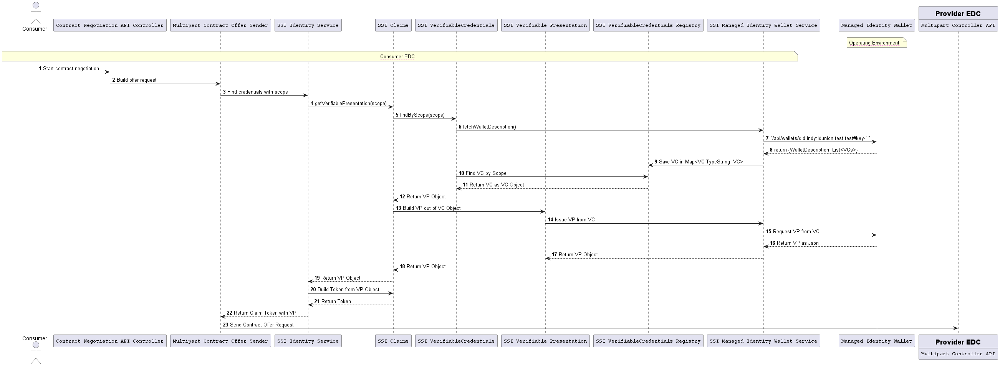
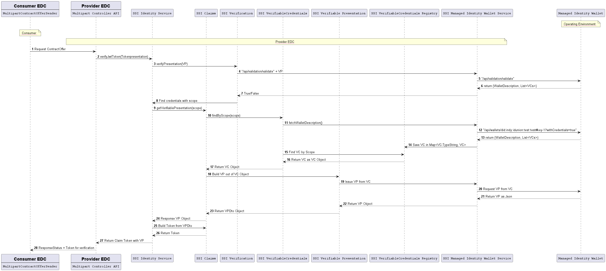
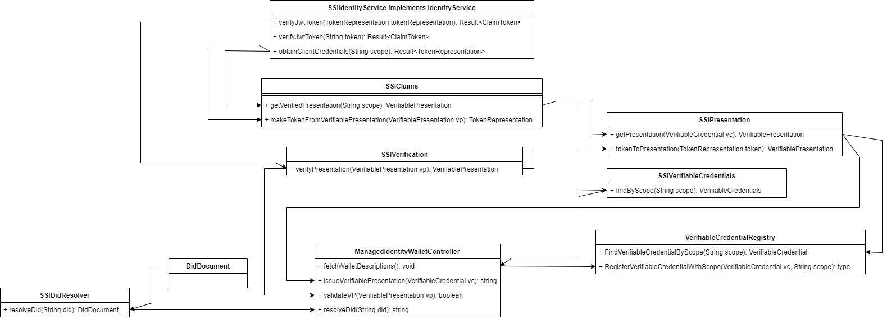

# EDC SSI-Extension

The SSI-Extension is an Identity Service which provides the possibility of connecting two EDCs with each other.
By presenting Claims as Verifiable Presentations which can be verified so that each other knows
who he is talking to without the need of logging in into another system.

## Verification Process

The process in which two EDCs connecting to each other is done by the ids:Multipart Controller,
in here we are concentrating of the token exchange and where the credentials come from.

### Usage 

For a example usage of the SSI extension, have a look on samples/06.0-ssi-authentication

### Limitations

The actual service don't validate the Token, this will be implemented as a Validation Service Endpoint.

### Sequence Diagram Consumer

### Sequence Diagram Provider

### Class Flow Diagram

### Configurations

| Key        | Description              | Example                                                                                         |
|:-----------|:-------------------------|-------------------------------------------------------------------------------------------------|
| ssi.miw.url   | Base Endpoint of the managed identity wallet  | `http://catenax-managed-identity-wallets.managed-identity-wallets.svc.cluster.local:8080`       |
| ssi.miw.did   | DID of the EDC's Company  | `did:sov:LXN15K33DXGN7MDB9QvFb1`                                                                |
| ssi.miw.bpn   |  BPN of the EDC's Company  | `BPNL000000000005`                                                                              |
| ssi.miw.trusted.providers    |  An array of dids (sperated with `;`) that are trusted as issuer of Verifiable Credentials| `did:sov:6EweqDHuRFExv8D9VSoP14;did:sov:6EweqDHuRFExv8D9VSoP14`                                 
| ssi.miw.accesstoken.url   |  the Url to get the access token from | `http://catenax-keycloak.managed-identity-wallets/realms/catenax/protocol/openid-connect/token` |
| ssi.miw.keycloak.clientid |  The client id in keycloak  | `ManagedIdentityWallets`                                                                        |
| ssi.miw.keycloak.clientsecret |  The client secret in keycloak  | `ManagedIdentityWallets-Secret`                                                                 |
| ssi.miw.keycloak.grandtype    |  The grandtype in keycloak  | `client_credentials`                                                                            |
| ssi.miw.keycloak.scope    |  The scope in keycloak  | `openid`                                                                                        |
| ssi.miw.logprefix |  BPN of the EDC's Company  | `ManagedIdentityWalletLogger`                                                                   |

 

