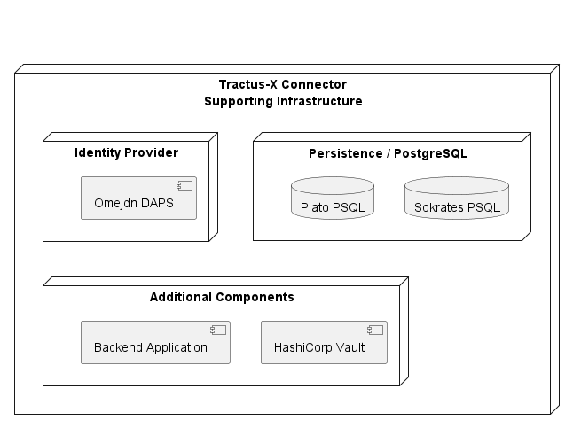

# Supporting Infrastructure Deployment

The Supporting Infrastructure Deployment creates a complete, independent and already configured EDC test environment.
During the automated business tests, these infrastructure components are deployed together with two connectors (Plato & Sokrates).

This deployment could also be used as

- reference setup for teams, that want to create their own connector
- standalone infrastructure to try things out

This deployment should **never** be used

- in **any** production or near production environments
- in **any** long living internet facing connector setups

## Components

Overview of the installed components.



### Omejdn DAPS

The Dynamic Attribute Provisioning Service (DAPS) is a component of the IDS Ecosystem.
The Fraunhofer Institute has created a DAPS reference implementation, the Omejdn
DAPS ([link](https://github.com/Fraunhofer-AISEC/omejdn-server)). This deplyoment configures and deployes a instance of
this reference implementation.

Definition of DAPS from the IDS Reference architecture v3.0
> The Identity Provider acts as an agent for the International
> Data Spaces Association. It is responsible for issuing technical identities to parties that have been approved to become
> Participants in the International Data Spaces. The Identity
> Provider is instructed to issue identities based on approved
> roles (e.g., App Store or App Provider). Only if equipped with
> such an identity, an entity is allowed to participate in the International Data Spaces

Also, please note, that the Omejdn DAPS is meant as research sandbox and should not be used in anq
productive environment.

> **IMPORTANT:** Omejdn is meant to be a research sandbox in which we can (re)implement standard protocols and
> potentially extend and modify functionality under the hood to support research projects. Use at your own
> risk! ([source](https://github.com/Fraunhofer-AISEC/omejdn-server))

### HashiCorp Vault

The Control- and Data Plane persist confidential in the vault and persist and communicate using only the secret
names. Hence, it is not possible to run a connector without an instance of a vault.

### Backend Application

After a Data Transfer is successfully prepared the control plane will contact the a configurable endpoint with the
information it needs to initiate the data transfer. This transfer flow, where something like a Backend Application is
required, is unique to the HTTP Proxy data transfer flow.

The Backend Application has an API endpoint, that is configured in the control plane. After it gets called with the data
transfer information, it will do the actual data transfer and store the data on disk.

### PostgreSQL

This database is used to persist the state of the Control Plane.

## Setup

Follow these steps to get a fully functional EDC demo environment out of the box.

### Requirements

Install on your machine:

- Minikube
    - Documentation https://minikube.sigs.k8s.io/docs/start/
- Helm
    - Documentation https://helm.sh/docs/intro/install/

## Start Demo Environment

**Update Helm Dependencies**

```bash
helm dependency update
```

**Install Demo Chart**

```bash
helm install tx-infrastructure --namespace tx --create-namespace .
```

## Stop Demo Environment

**Uninstall Demo Chart**

```bash
helm uninstall tx-infrastructure --namespace tx
```
