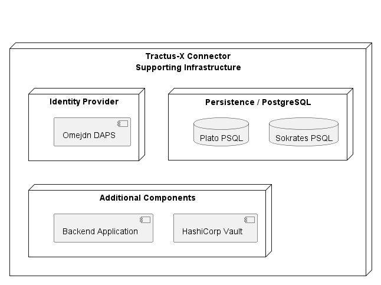

# All-In-One Deployment

The Product EDC Demo Deployment creates a complete, independent and already configured EDC test environment.

This deployment may function as

- reference setup for teams, that want to create their own connector
- standalone test environment to try different things out

## Setup

Follow these steps to get a fully functional EDC demo environment out of the box.

### Requirements

Install on your machine:

- Minikube
    - Documentation https://minikube.sigs.k8s.io/docs/start/
- Helm
    - Documentation https://helm.sh/docs/intro/install/

## Start Demo Environment

**Update Helm Dependencies**

```bash
helm dependency update
```

**Install Demo Chart**

```bash
helm install edc-all-in-one --namespace edc-all-in-one --create-namespace .
```

This will deploy the following components:



## Stop Demo Environment

**Uninstall Demo Chart**

```bash
helm uninstall edc-all-in-one --namespace edc-all-in-one
```

## Components

Overview of the installed components.

### EDC Control Plane

The EDC Control Plane does

- data/contract offering
- contract negotiation
- data transfer coordination

Two control planes always talk to each other using IDS messages. Therefore, when telling one connector to talk to
another connector, the target endpoint must point to the IDS API (e.g `http://[myTargetConnector].com/api/v1/ids`).

The connector owner should only talk to the control plane via the Data Management API. The API is not only used for
simple data management, but for initiating inter-connector communication as well.

### EDC Data Plane

The EDC Data Plane is used for the actual data transfer.

At the time of writing the Data Plane may only function as HTTP proxy and does not support any other type of
transfer. Additional transfer capabilities could be added by including new EDC extensions in the Data Plane application.

### PostgreSQL

This database is used to persist the state of the Control Plane.

### HashiCorp Vault

The Control- and Data Plane will persist confidential in the vault and persist and communicate using only the secret
names.

### Backend Application

After a Data Transfer is successfully prepared the control plane will contact the a configurable endpoint with the
information it needs to initiate the data transfer. This transfer flow, where something like a Backend Application is
required, is unique to the HTTP Proxy data transfer flow.

The Backend Application has an API endpoint, that is configured in the control plane. After it gets called with the data
transfer information, it will do the actual data transfer and store the data on disk.

### Omejdn DAPS

Instead of the Catena-X DAPS this demo configures and deploys it's own DAPS instance.
